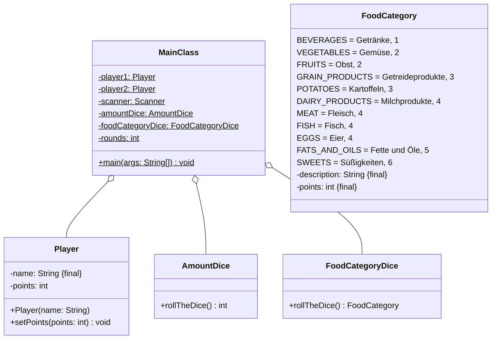

Setze das abgebildete Klassendiagramm vollständig um. Orientiere Dich bei der
Konsolenausgabe am abgebildeten Beispiel.

## Klassendiagramm



## Allgemeine Hinweise

- Aus Gründen der Übersicht werden im Klassendiagramm keine Getter und
  Object-Methoden dargestellt
- So nicht anders angegeben, sollen Konstruktoren, Setter, Getter sowie die
  Object-Methoden wie gewohnt implementiert werden

## Hinweis zur Klasse _AmountDice_

Die Methode `int rollTheDice()` soll mit einer gleichverteilten
Wahrscheinlichkeit einen Wert zwischen 1 und 6 zurückgeben.

## Hinweis zur Klasse _FoodCategoryDice_

Die Methode `FoodCategory rollTheDice()` soll mit einer gleichverteilten
Wahrscheinlichkeit eine Lebensmittelkategorie zurückgeben.

## Hinweis zur Klasse _Player_

Der Konstruktor soll den Spielernamen (`name`) initialisieren.

## Spielablauf

- Zwei Spieler sollen abwechselnd solange zwei Würfel (einen
  Lebensmittelkategorie-Würfel und einen Zahlenwürfel) werfen, bis einer der
  beiden Spieler keine Punkte mehr hat
- In jeder Runde verliert der Spieler mit dem schlechteren Wurfwert Punkte,
  wobei diesem Spieler die Differenz der beiden Wurfwerte abgezogen wird
- Der Wurfwert berechnet sich nach der Formel
  `Zahlenwert des Zahlenwürfels * Punktwert der gewürfelten Lebensmittelkategorie`
- Beide Spieler sollen zu Beginn des Spiels ihre Namen eingeben können und
  sollen das Spiel mit 100 Punkte beginnen

## Beispielhafte Konsolenausgabe

```console
Spieler 1, gib bitte Deinen Namen ein: Hans
Spieler 2, gib bitte Deinen Namen ein: Peter

Runde 1
Hans hat 100 Punkte, Peter hat 100 Punkte
Hans würfelt 1 x Eier (4 Punkte)
Peter würfelt 2 x Süßigkeiten (12 Punkte)
Hans werden 8 Punkte abgezogen
...
Runde 13
Hans hat 4 Punkte, Peter hat 30 Punkte
Hans würfelt 1 x Obst (2 Punkte)
Peter würfelt 5 x Fleisch (20 Punkte)
Hans werden 18 Punkte abgezogen

Peter hat gewonnen
```
