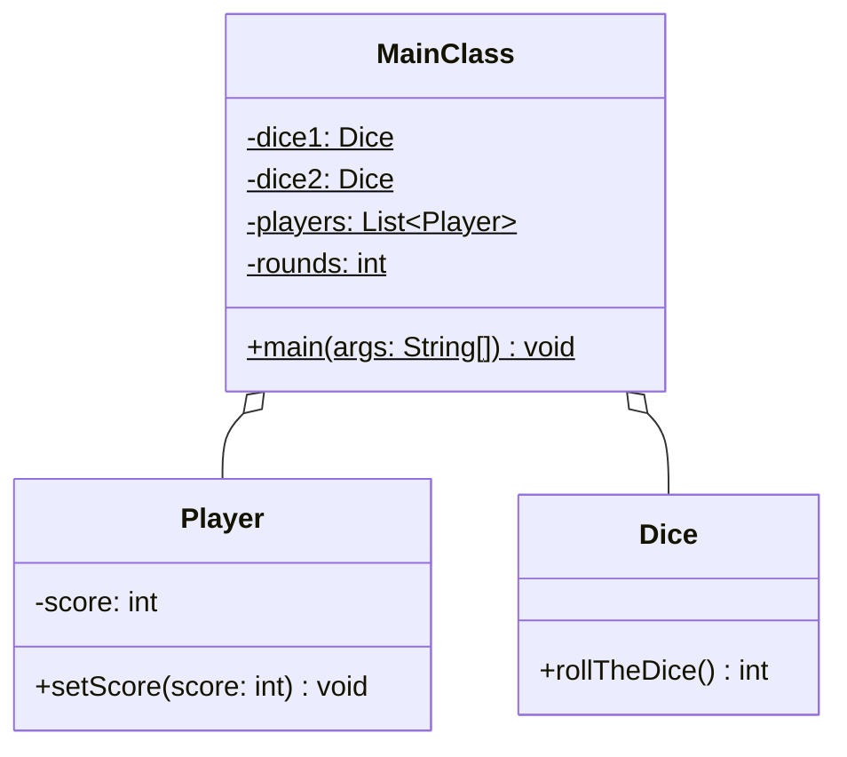

Setze das abgebildete Klassendiagramm vollständig um. Orientiere Dich bei der
Konsolenausgabe am abgebildeten Beispiel.

## Klassendiagramm



## Allgemeine Hinweise

- Aus Gründen der Übersicht werden im Klassendiagramm keine Getter und
  Object-Methoden dargestellt
- So nicht anders angegeben, sollen Konstruktoren, Setter, Getter sowie die
  Object-Methoden wie gewohnt implementiert werden

## Hinweis zur Klasse _Dice_

Die Methode `int rollTheDice()` soll mit einer gleichverteilten
Wahrscheinlichkeit einen Wert zwischen 1 und 6 zurückgeben.

## Spielablauf

Zwei Spieler sollen abwechselnd solange zwei Würfel werfen, bis einer der beiden
Spieler 50 oder mehr Punkte besitzt.

## Beispielhafte Konsolenausgabe

```console
| Runde | Spieler 1 | Spieler 2 |
| ----- | --------- | --------- |
|     1 |         8 |         2 |
|     2 |        14 |         8 |
|     3 |        20 |        10 |
|     4 |        26 |        19 |
|     5 |        35 |        29 |
|     6 |        42 |        37 |
|     7 |        48 |        45 |
|     8 |        50 |        49 |
```
