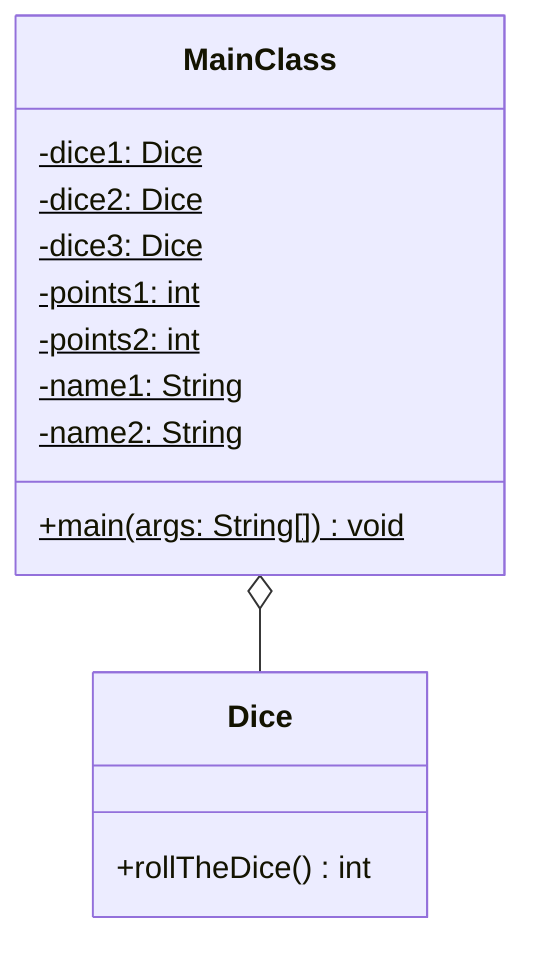

Setze das abgebildete Klassendiagramm vollständig um. Orientiere Dich bei der
Konsolenausgabe am abgebildeten Beispiel.

## Klassendiagramm



## Allgemeine Hinweise

- Aus Gründen der Übersicht werden im Klassendiagramm keine Getter und
  Object-Methoden dargestellt
- So nicht anders angegeben, sollen Konstruktoren, Setter, Getter sowie die
  Object-Methoden wie gewohnt implementiert werden

## Hinweis zur Klasse _Dice_

Die Methode `int rollTheDice()` soll mit einer gleichverteilten
Wahrscheinlichkeit einen Wert zwischen 1 und 6 zurückgeben.

## Spielablauf

- Das Spiel soll aus 5 Runden bestehen
- Zu Beginn des Spiels sollen die Spieler ihre Namen eingeben können
- Zu Beginn jeder Runde soll jeder Spieler abwechselnd drei Würfel werfen
- Anschließend soll der Spieler mit dem höheren Wurfwert einen Punkt bekommen
- Bei gleich hohen Wurfwerten sollen beide Spieler einen Punkt bekommen

## Beispielhafte Konsolenausgabe

```console
Spieler 1, bitte Namen eingeben: Hans
Spieler 2, bitte Namen eingeben: Peter

| Runde |       Hans |      Peter |
| ----- | ---------- | ---------- |
|     1 |          9 |          7 |
|     2 |         12 |         10 |
|     3 |          7 |         13 |
|     4 |          8 |         10 |
|     5 |          8 |         11 |

Hans: 2 Punkte
Peter: 3 Punkte
Peter gewinnt
```
