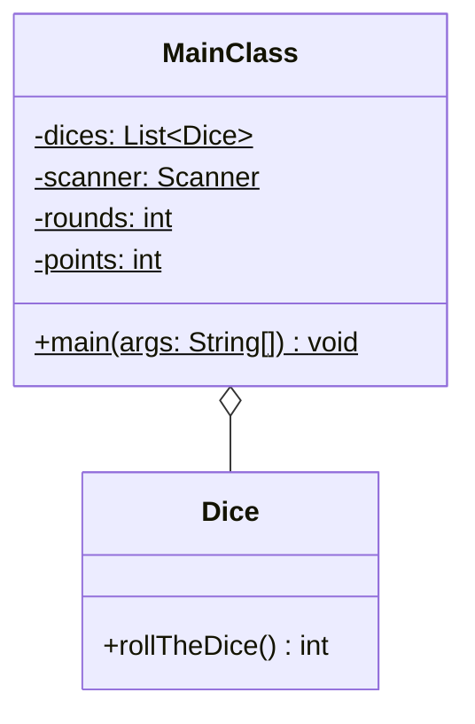

Setze das abgebildete Klassendiagramm vollständig um. Orientiere Dich bei der
Konsolenausgabe am abgebildeten Beispiel.

## Klassendiagramm



## Allgemeine Hinweise

- Aus Gründen der Übersicht werden im Klassendiagramm keine Getter und
  Object-Methoden dargestellt
- So nicht anders angegeben, sollen Konstruktoren, Setter, Getter sowie die
  Object-Methoden wie gewohnt implementiert werden

## Hinweis zur Klasse _Dice_

Die Methode `int rollTheDice()` soll mit einer gleichverteilten
Wahrscheinlichkeit einen Wert zwischen 1 und 6 zurückgeben.

## Spielablauf

- Das Spiel soll aus beliebig vielen Runden bestehen
- Zu Beginn jeder Runde sollen alle Würfen geworfen werden
- Anschließend soll der Spieler eingeben können, ob der Wurfwert aller Würfel
  größer 17 ist
- Für einen richtigen Tipp soll der Spieler einen Punkt bekommen
- Am Ende des Spiels soll die Anzahl der Runden sowie die Anzahl Punkte
  ausgegeben werden

## Beispielhafte Konsolenausgabe

```console
Wurf groesser 17?: false
Richtig, der Wurf war 15
Nochmal?: true

Wurf groesser 17?: true
Falsch, der Wurf war 14
Nochmal?: false

Runden: 2 Punkte: 1
```
