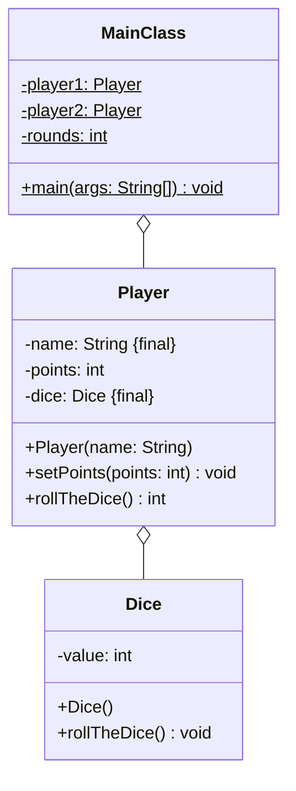

Setze das abgebildete Klassendiagramm vollständig um. Orientiere Dich bei der
Konsolenausgabe am abgebildeten Beispiel.

## Klassendiagramm



## Allgemeine Hinweise

- Aus Gründen der Übersicht werden im Klassendiagramm keine Getter und
  Object-Methoden dargestellt
- So nicht anders angegeben, sollen Konstruktoren, Setter, Getter sowie die
  Object-Methoden wie gewohnt implementiert werden

## Hinweise zur Klasse _Dice_

- Der Konstruktor soll den Würfel werfen
- Die Methode `void rollTheDice()` soll mit einer gleichverteilten
  Wahrscheinlichkeit dem Würfelwert einen Wert zwischen 1 und 6 zuweisen

## Spielablauf

- Das Spiel soll aus mehreren Runden bestehen
- Zu Beginn des Spiels sollen beide Spieler ihre Namen eingeben können
- In jeder Runde sollen beide Spieler abwechselnd ihren jeweiligen Würfel werfen
  und den jeweiligen Wurfwert als Punkte gutgeschrieben bekommen
- Das Spiel soll Enden, sobald ein Spieler 50 oder mehr Punkte besitzt
- Am Ende des Spiels sollen die Punkte beider Spieler ausgegeben werden

## Beispielhafte Konsolenausgabe

```console
Bitte den Namen von Spieler 1 eingeben: Hans
Bitte den Namen von Spieler 2 eingeben: Peter

Runde: 1
Hans würfelt 5
Peter würfelt 2

Runde: 2
Hans würfelt 6
Peter würfelt 5
...
Runde: 13
Hans würfelt 1
Peter würfelt 5

Punktzahl Hans: 44
Punktzahl Peter: 51
```
