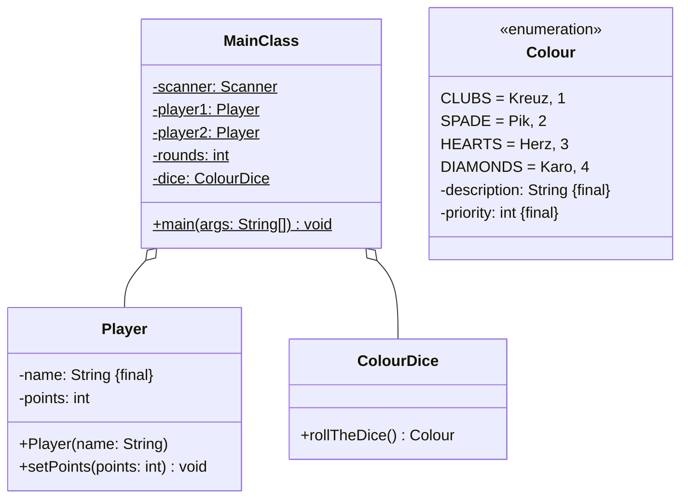

Setze das abgebildete Klassendiagramm vollständig um. Orientiere Dich bei der
Konsolenausgabe am abgebildeten Beispiel.

## Klassendiagramm



## Allgemeine Hinweise

- Aus Gründen der Übersicht werden im Klassendiagramm keine Getter und
  Object-Methoden dargestellt
- So nicht anders angegeben, sollen Konstruktoren, Setter, Getter sowie die
  Object-Methoden wie gewohnt implementiert werden

## Hinweis zur Klasse _ColourDice_

Die Methode `Colour rollTheDice()` soll mit einer gleichverteilten
Wahrscheinlichkeit eine Farbe (Kreuz, Pik, Herz oder Karo) zurückgeben.

## Spielablauf

- Das Spiel soll aus mehreren Runden bestehen
- Zu Beginn des Spiels sollen beide Spieler ihre Namen sowie die Anzahl Runden
  eingeben können
- Zu Beginn jeder Runde sollen beide Spieler abwechselnd den Würfel werfen
- Anschließend soll der Spieler, dessen gewürfelte Farbe den niedrigeren
  Prioritätwert besitzt, einen Punkt bekommen
- Erwürfeln beide Spieler die gleiche Farbe, soll keiner der Spieler einen Punkt
  bekommen
- Am Ende des Spiels sollen die Punkte beider Spieler ausgegeben werden

## Beispielhafte Konsolenausgabe

```console
Bitte den Namen von Spieler 1 eingeben: Hans
Bitte den Namen von Spieler 2 eingeben: Peter
Bitte die Anzahl Runden eingeben: 3

Runde: 1
Hans würfelt Pik
Peter würfelt Herz
Hans erzielt einen Punkt

Runde: 2
Hans würfelt Kreuz
Peter würfelt Kreuz
Keiner erzielt einen Punkt

Runde: 3
Hans würfelt Herz
Peter würfelt Kreuz
Peter erzielt einen Punkt

Punktzahl Hans: 1
Punktzahl Peter: 1
```
