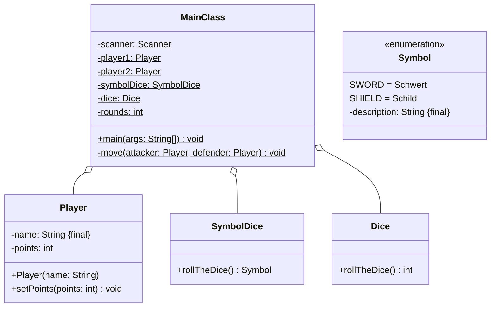

Setze das abgebildete Klassendiagramm vollständig um. Orientiere Dich bei der
Konsolenausgabe am abgebildeten Beispiel.

## Klassendiagramm



## Allgemeine Hinweise

- Aus Gründen der Übersicht werden im Klassendiagramm keine Getter und
  Object-Methoden dargestellt
- So nicht anders angegeben, sollen Konstruktoren, Setter, Getter sowie die
  Object-Methoden wie gewohnt implementiert werden

## Hinweis zur Klasse _SymbolDice_

Die Methode `Symbol rollTheDice()` soll mit einer gleichverteilten
Wahrscheinlichkeit ein Symbol (Schwert, Schild) zurückgeben.

## Hinweis zur Klasse _Dice_

Die Methode `int rollTheDice()` soll mit einer gleichverteilten
Wahrscheinlichkeit einen Wert zwischen 1 und 6 zurückgeben.

## Hinweis zur Klasse _Player_

Der Konstruktor soll den Namen mit dem eingehenden Namen und die Punkte mit dem
Wert 10 initialisieren.

## Hinweis zur Klasse _MainClass_

Die Methode `void move(attacker: Player, defender: Player)` soll einen Spielzug
implementieren.

## Spielablauf

- Das Spiel soll aus mehreren Runden bestehen
- Zu Beginn des Spiels sollen beide Spieler ihren Namen eingeben können
- In jeder Runde sollen beide Spieler abwechselnd jeweils einen Spielzug
  durchführen können
- Das Spiel soll enden, sobald ein Spieler 0 hat
- Am Ende des Spiels soll der Gewinner ausgegeben werden

## Ablauf einese Spielzugs

- Zu Beginn eines Spielzugs soll der angreifende Spieler beide Würfel werfen.
  Erwürfelt der angreifende Spieler ein Schwert, beträgt der Angriffswert den
  Wurfwert des normalen Würfels
- Anschließend soll der verteidigende Spieler beide Würfel werden. Erwürfelt der
  verteidigende Spieler ein Schild, beträgt der Verteidigungswert den Wurfwert
  des normalen Würfels
- Anschließend soll der Schaden gemäß der Formel _Angriffswert -
  Verteidungswert_ berechnet werden
- Anschließend sollen dem verteidigenden Spieler Punkte in Höhe des Schadens
  abgezogen werden, wobei der Wert 0 nicht unterschritten werden soll
- Am Ende des Spielzugs soll ausgegeben werden, wie viel Schaden der
  verteidigenden Spieler erlitten hat, und wie viele Punkte der verteidigende
  Spieler noch besitzt

## Beispielhafte Konsolenausgabe

```console
Spieler 1, bitte Namen eingeben: Hans
Spieler 2, bitte Namen eingeben: Peter

Runde 1
Hans würfelt 1 Schwerter
Peter würfelt 5 Schilde
Peter erleidet 0 Schaden und besitzt noch 10 Punkte

Peter würfelt 6 Schwerter
Hans würfelt 2 Schilde
Hans erleidet 4 Schaden und besitzt noch 6 Punkte

Runde 2
Hans würfelt 2 Schwerter
Peter würfelt 0 Schilde
Peter erleidet 2 Schaden und besitzt noch 8 Punkte

Peter würfelt 6 Schwerter
Hans würfelt 0 Schilde
Hans erleidet 6 Schaden und besitzt keine Punkte mehr

Peter gewinnt
```
