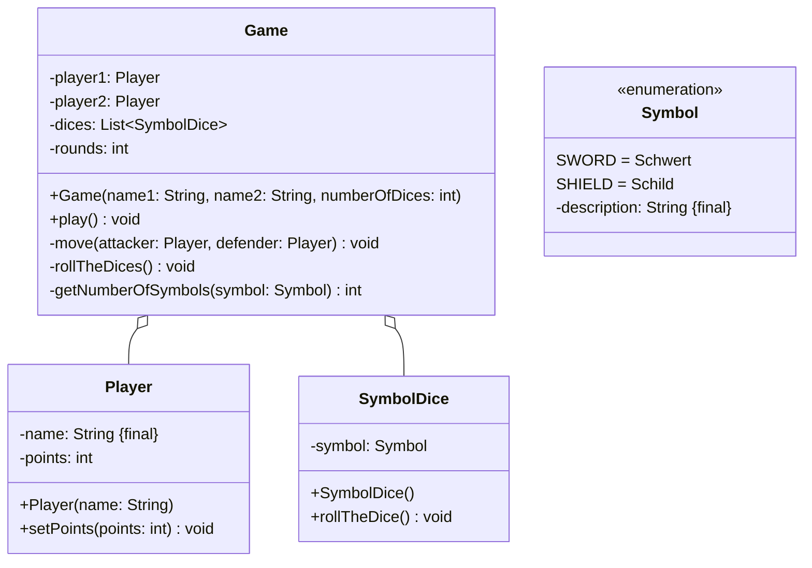

Setze das abgebildete Klassendiagramm vollständig um. Orientiere Dich bei der
Konsolenausgabe am abgebildeten Beispiel. Erstelle zum Testen eine ausführbare
Klasse.

## Klassendiagramm



## Allgemeine Hinweise

- Aus Gründen der Übersicht werden im Klassendiagramm keine Getter und
  Object-Methoden dargestellt
- So nicht anders angegeben, sollen Konstruktoren, Setter, Getter sowie die
  Object-Methoden wie gewohnt implementiert werden

## Hinweise zur Klasse _SymbolDice_

- Der Konstruktor soll den Würfel werfen
- Die Methode `void rollTheDice()` soll mit einer gleichverteilten
  Wahrscheinlichkeit dem Symbol einen Wert (Schwert, Schild) zuweisen

## Hinweis zur Klasse _Player_

Der Konstruktor soll den Namen mit dem eingehenden Namen und die Punkte mit dem
Wert 10 initialisieren.

## Hinweise zur Klasse _Game_

- Der Konstruktor soll die Spieler mit Hilfe der eingehenden Namen
  initialisieren und die Würfelliste mit Hilfe der eingehenden Anzahl Würfel
  initialisieren
- Die Methode `void play()` soll den Spielablauf abbilden
- Die Methode `void move(attacker: Player, defender: Player)` soll einen
  Spielzug abbilden
- Die Methode `void rollTheDices()` soll alle Würfel werfen
- Die Methode `int getNumberOfSymbols(symbol: Symbol)` soll die Anzahl der
  Würfel zum eingehenden Symbol zurückgeben

## Spielablauf

- Das Spiel soll aus mehreren Runden bestehen
- In jeder Runde sollen beide Spieler abwechselnd jeweils einen Spielzug
  durchführen können
- Das Spiel soll enden, sobald ein Spieler 0 Punkte hat

## Ablauf eines Spielzugs

- Zu Beginn eines Spielzugs sollen beide Spieler abwechselnd alle Würfen werfen
- Anschließend sollen für den angreifenden Spieler die Anzahl geworfener
  Schwerter und für der verteidigende Spieler die Anzahl geworfener Schilde
  ermittelt werden
- Anschließend soll der Schaden gemäß der Formel _Anzahl Schwerter - Anzahl
  Schilde_ berechnet werden
- Anschließend sollen dem verteidigenden Spieler Punkte in Höhe des Schadens
  abgezogen werden, wobei der Wert 0 nicht unterschritten werden soll
- Am Ende des Spielzugs soll ausgegeben werden, wie viel Schaden der
  verteidigenden Spieler erlitten hat, und wie viele Punkte der verteidigende
  Spieler noch besitzt

## Beispielhafte Konsolenausgabe

```console
Runde 1
Hans würfelt 5 Schwerter
Peter würfelt 0 Schilde
Peter erleidet 5 Schaden und besitzt noch 5 Punkte

Peter würfelt 0 Schwerter
Hans würfelt 5 Schilde
Hans erleidet 0 Schaden und besitzt noch 10 Punkte
...
Runde 6
Hans würfelt 3 Schwerter
Peter würfelt 2 Schilde
Peter erleidet 1 Schaden und besitzt keine Punkte mehr
```
