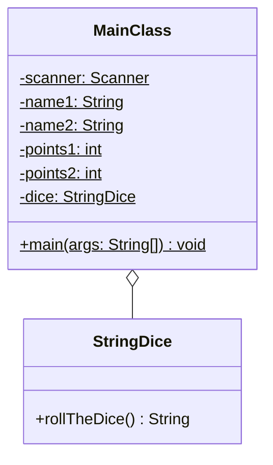

Setze das abgebildete Klassendiagramm vollständig um. Orientiere Dich bei der
Konsolenausgabe am abgebildeten Beispiel.

## Klassendiagramm



## Allgemeine Hinweise

- Aus Gründen der Übersicht werden im Klassendiagramm keine Getter und
  Object-Methoden dargestellt
- So nicht anders angegeben, sollen Konstruktoren, Setter, Getter sowie die
  Object-Methoden wie gewohnt implementiert werden

## Hinweis zur Klasse _StringDice_

Die Methode `String rollTheDice()` soll eine zufällige 5-stellige Zeichenkette
zurückgeben.

## Spielablauf

- Das Spiel soll aus mehreren Runden bestehen
- Zu Beginn des Spiel sollen die beiden Spieler ihre Namen sowie die
  erforderlichen Punkte eingeben können
- Zu Beginn jeder Runde sollen die Spieler abwechselnd den Würfel werden. Der
  Spieler mit dem höheren Wurfwert soll einen Punkt bekommen. Für den Fall, dass
  beide Spieler den gleichen Wurfwert erzielen, soll keiner einen Punkt
  bekommen. Als Wurfwert soll der Hashwert der geworfenen Zeichenkette verwendet
  werden
- Das Spiel soll enden, sobald ein Spieler die erforderliche Punktzahl erreicht
  hat
- Am Ende sollen die Punktzahlen beider Spieler ausgegeben werden

## Beispielhafte Konsolenausgabe

```console
Gib bitte den Namen von Spieler 1 ein: Hans
Gib bitte den Namen von Spieler 2 ein: Peter
Gib bitte die erforderlichen Punkte ein: 3

Hans würfelt "vraad", der Hashwert beträgt 112467976
Peter würfelt "mtstk", der Hashwert beträgt 104233763
Hans bekommt einen Punkt

Hans würfelt "txhyd", der Hashwert beträgt 110807151
Peter würfelt "czjlq", der Hashwert beträgt 95168408
Hans bekommt einen Punkt

Hans würfelt "elqst", der Hashwert beträgt 96605323
Peter würfelt "jmkni", der Hashwert beträgt 101246787
Peter bekommt einen Punkt

Hans würfelt "qzylh", der Hashwert beträgt 108112108
Peter würfelt "kpuas", der Hashwert beträgt 102268898
Hans bekommt einen Punkt

Hans: 3
Peter: 1
```
