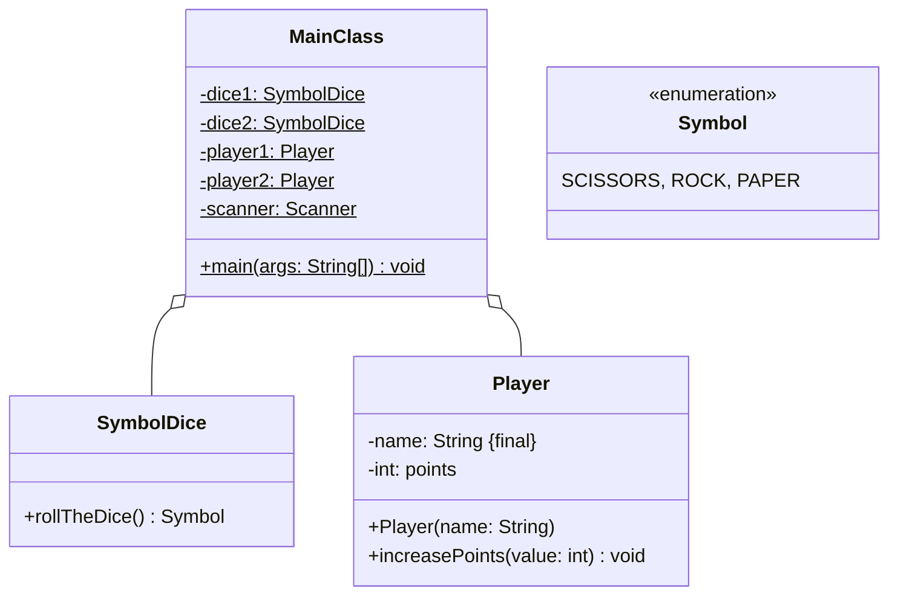

Setze das abgebildete Klassendiagramm vollständig um. Orientiere Dich bei der
Konsolenausgabe am abgebildeten Beispiel.

## Klassendiagramm



## Allgemeine Hinweise

- Aus Gründen der Übersicht werden im Klassendiagramm keine Getter und
  Object-Methoden dargestellt
- So nicht anders angegeben, sollen Konstruktoren, Setter, Getter sowie die
  Object-Methoden wie gewohnt implementiert werden

## Hinweis zur Klasse _SymbolDice_

Die Methode `Symbol rollTheDice()` soll mit einer gleichverteilten
Wahrscheinlichkeit ein Symbol (Schere, Stein oder Papier) zurückgeben.

## Spielablauf

- Das Spiel soll aus 5 Runden bestehen
- Zu Beginn des Spiel sollen die beiden Spieler ihre Namen eingeben können
- Zu Beginn jeder Runde sollen die Spieler abwechselnd den Würfel werden. Der
  Spieler mit dem besseren Wurfwert soll einen Punkt bekommen. Für den Fall,
  dass beide Spieler den gleichen Wurfwert erzielen, soll keiner einen Punkt
  bekommen. Für den Wurfwert soll gelten: Schere schlägt Papier, Papier schlägt
  Stein, Stein schlägt Schere
- Am Ende soll der Gewinner ausgegeben werden

## Beispielhafte Konsolenausgabe

```console
Spieler 1, bitte gib Deinen Namen ein: Hans
Spieler 2, bitte gib Deinen Namen ein: Peter

Hans würfelt SCISSORS, Peter würfelt ROCK
Punkt für Peter

Hans würfelt SCISSORS, Peter würfelt PAPER
Punkt für Hans

Hans würfelt ROCK, Peter würfelt PAPER
Punkt für Peter

Hans würfelt SCISSORS, Peter würfelt ROCK
Punkt für Peter

Hans würfelt ROCK, Peter würfelt ROCK
Keiner bekommt einen Punkt

Peter gewinnt
```
