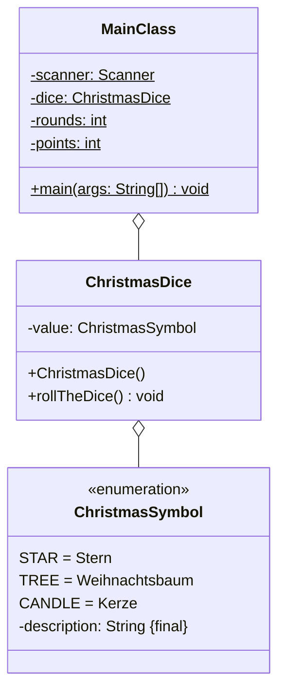

Setze das abgebildete Klassendiagramm vollständig um. Orientiere Dich bei der
Konsolenausgabe am abgebildeten Beispiel.

## Klassendiagramm



## Allgemeine Hinweise

- Aus Gründen der Übersicht werden im Klassendiagramm keine Getter und
  Object-Methoden dargestellt
- So nicht anders angegeben, sollen Konstruktoren, Setter, Getter sowie die
  Object-Methoden wie gewohnt implementiert werden

## Hinweise zur Klasse _ChristmasDice_

- Der Konstruktor soll den Würfel werfen
- Die Methode `void rollTheDice()` soll mit einer gleichverteilten
  Wahrscheinlichkeit dem Weihnachts-Symbol einen Wert (Stern, Weihnachtsbaum
  oder Kerze) zuweisen

## Spielablauf

- Das Spiel soll aus mehreren Runden bestehen
- Zu Beginn des Spiel soll der Spieler die Anzahl Runden eingeben können
- Zu Beginn einer jeden Runde soll der Würfel geworfen werden
- Nach dem Wurf soll der Spieler eingeben, welches Weihnachts-Symbol geworfen
  wurde. Liegt er richtig, erhält er einen Punkt
- Am Ende des Spiels sollen die Anzahl Runden, die Punkte sowie die
  Trefferwahrscheinlichkeit in Prozent ausgegeben werden

## Beispielhafte Konsolenausgabe

```console
Wie viele Runden möchtest Du spielen?: 3

Runde 1:
Rate, welches Symbol gewürfelt wurde (1-Stern, 2-Baum, 3-Kerze): 2
Falsch, Du erhälst leider keinen Punkt

Runde 2:
Rate, welches Symbol gewürfelt wurde (1-Stern, 2-Baum, 3-Kerze): 1
Falsch, Du erhälst leider keinen Punkt

Runde 3:
Rate, welches Symbol gewürfelt wurde (1-Stern, 2-Baum, 3-Kerze): 1
Richtig, Du erhälst einen Punkt

Ergebnis
Anzahl Runden: 3
Deine Punkte: 1
Deine Trefferquote 33.333333333333336%
```
