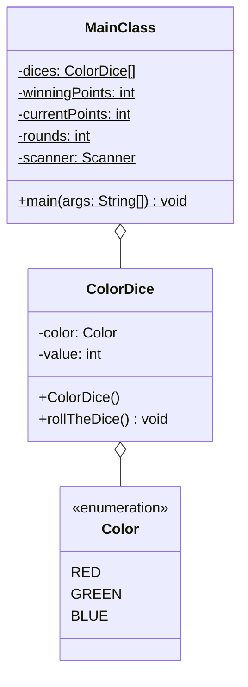

Setze das abgebildete Klassendiagramm vollständig um. Orientiere Dich bei der
Konsolenausgabe am abgebildeten Beispiel.

## Klassendiagramm



## Allgemeine Hinweise

- Aus Gründen der Übersicht werden im Klassendiagramm keine Getter und
  Object-Methoden dargestellt
- So nicht anders angegeben, sollen Konstruktoren, Setter, Getter sowie die
  Object-Methoden wie gewohnt implementiert werden

## Hinweise zur Klasse _ColorDice_

- Der Konstruktor soll den Würfel werfen
- Die Methode `void rollTheDice()` soll mit einer gleichverteilten
  Wahrscheinlichkeit der Farbe einen Wert (Rot, Grün oder Blau) und ebenfalls
  mit einer gleichverteilten Wahrscheinlichkeit dem Würfelwert einen Wert
  zwischen 1 und 4 zuweisen

## Spielablauf

- Das Spiel soll aus mehreren Runden bestehen
- Zu Beginn des Spiels soll der Spieler die notwendige Gewinnpunkte eingeben
  können
- Zu Beginn einer jeden Runde soll der Spieler eine Farbe eingeben können
- Anschließend sollen alle 5 Würfel geworfen und die Summe aller Wurfwerte je
  Farbe ermittelt werden
- Hat der Spieler eine der Farben mit dem höchsten Gesamt-Wurfwert eingegeben,
  soll der Spieler einen Punkt bekommen
- Das Spiel soll enden, sobald der Spiele die notwendigen Gewinnpunkte erreicht
  hat
- Am Ende des Spiels soll die Anzahl gespielter Runden ausgegeben werden

## Beispielhafte Konsolenausgabe

```console
Bitte Gewinnpunkte eingeben: 3

Bitte Farbe (Rot, Grün oder Blau) eingeben: Blau
Wurfwerte Rot: 7
Wurfwerte Grün: 3
Wurfwerte Blau: 0
Leider falsch, Du bekommst leider keinen Punkt

Bitte Farbe (Rot, Grün oder Blau) eingeben: Rot
Wurfwerte Rot: 5
Wurfwerte Grün: 2
Wurfwerte Blau: 3
Richtig, Du bekommst einen Punkt

Bitte Farbe (Rot, Grün oder Blau) eingeben: Blau
Wurfwerte Rot: 2
Wurfwerte Grün: 4
Wurfwerte Blau: 3
Leider falsch, Du bekommst leider keinen Punkt

Bitte Farbe (Rot, Grün oder Blau) eingeben: Blau
Wurfwerte Rot: 3
Wurfwerte Grün: 2
Wurfwerte Blau: 3
Richtig, Du bekommst einen Punkt

Bitte Farbe (Rot, Grün oder Blau) eingeben: Grün
Wurfwerte Rot: 4
Wurfwerte Grün: 5
Wurfwerte Blau: 3
Richtig, Du bekommst einen Punkt

Du hast 5 Runden benötigt
```
