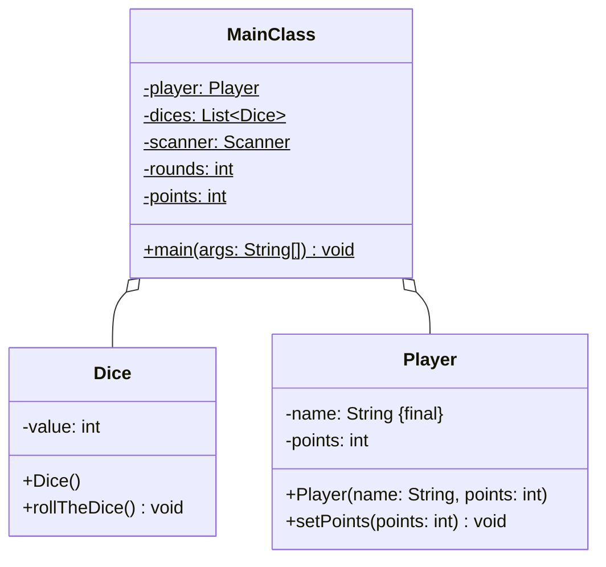

Setze das abgebildete Klassendiagramm vollständig um. Orientiere Dich bei der
Konsolenausgabe am abgebildeten Beispiel.

## Klassendiagramm



## Allgemeine Hinweise

- Aus Gründen der Übersicht werden im Klassendiagramm keine Getter und
  Object-Methoden dargestellt
- So nicht anders angegeben, sollen Konstruktoren, Setter, Getter sowie die
  Object-Methoden wie gewohnt implementiert werden

## Hinweise zur Klasse _Dice_

- Der Konstruktor soll den Würfel werfen
- Die Methode `void rollTheDice()` soll mit einer gleichverteilten
  Wahrscheinlichkeit dem Würfelwert einen Wert zwischen 1 und 6 zuweisen

## Spielablauf

- Das Spiel soll aus mehreren Runden bestehen
- Zu Beginn des Spiels soll der Spieler seinen Namen, die Anzahl Würfel sowie
  die Zielpunktzahl eingeben können
- In jeder Runde sollen zunächst alle Würfel geworfen werden
- Anschließend sollen die erzielten Wurfwerte in der jeweiligen Runde, die
  insgesamt erzielten Punkte sowie die Punkte pro Wurf in der jeweiligen Runde
  ausgegeben werden
- Das Spiel soll enden, sobald die Zielpunktzahl erreicht ist

## Beispielhafte Konsolenausgabe

```console
Bitte gib Deinen Namen ein: Hans
Bitte gib die Anzahl Würfel ein: 3
Bitte gib die Zielpunktzahl ein: 50

Gespielte Runden: 1
Erzielte Punkte in dieser Runde: 8
Erzielte Punkte insgesamt: 8
Erzielte Punkte pro Wurf in dieser Runde: 2.6666666666666665

Gespielte Runden: 2
Erzielte Punkte in dieser Runde: 11
Erzielte Punkte insgesamt: 19
Erzielte Punkte pro Wurf in dieser Runde: 3.6666666666666665

Gespielte Runden: 3
Erzielte Punkte in dieser Runde: 13
Erzielte Punkte insgesamt: 32
Erzielte Punkte pro Wurf in dieser Runde: 4.333333333333333

Gespielte Runden: 4
Erzielte Punkte in dieser Runde: 8
Erzielte Punkte insgesamt: 40
Erzielte Punkte pro Wurf in dieser Runde: 2.6666666666666665

Gespielte Runden: 5
Erzielte Punkte in dieser Runde: 15
Erzielte Punkte insgesamt: 55
Erzielte Punkte pro Wurf in dieser Runde: 5.0
```
