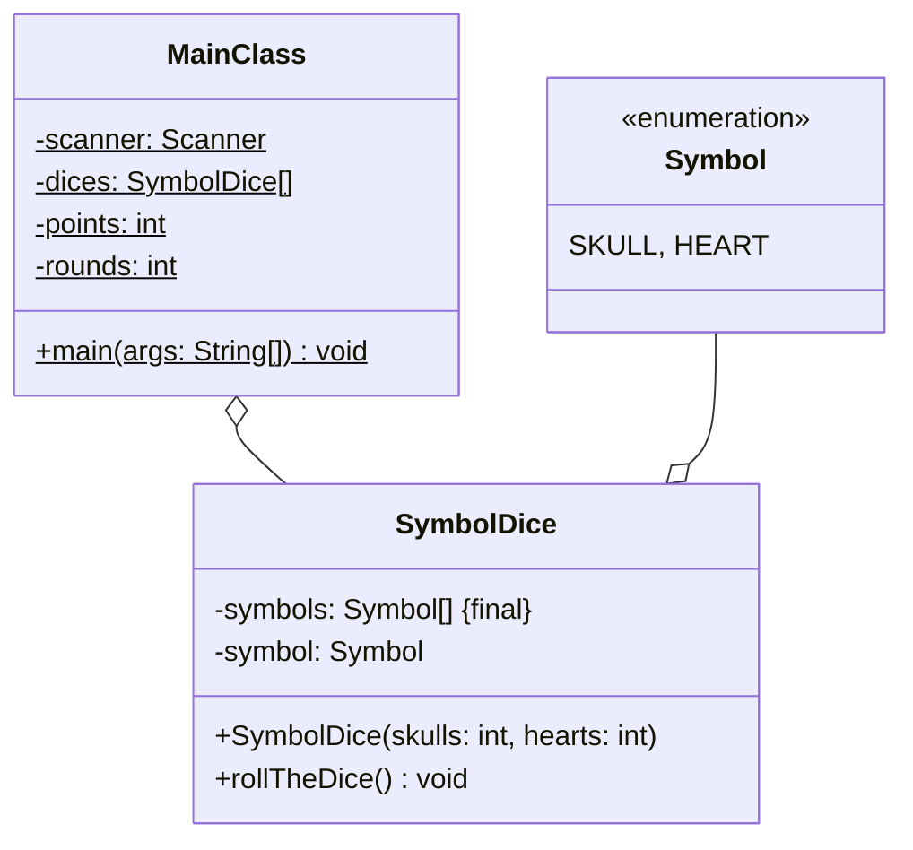

Setze das abgebildete Klassendiagramm vollständig um. Orientiere Dich bei der
Konsolenausgabe am abgebildeten Beispiel.

## Klassendiagramm



## Allgemeine Hinweise

- Aus Gründen der Übersicht werden im Klassendiagramm keine Getter und
  Object-Methoden dargestellt
- So nicht anders angegeben, sollen Konstruktoren, Setter, Getter sowie die
  Object-Methoden wie gewohnt implementiert werden

## Hinweise zur Klasse _SymbolDice_

- Der Konstruktor soll zunächst die Symbole des Würfels mit Hilfe der
  eingehenden Anzahl Herzen und Totenköpfe initialisieren und anschließend den
  Würfel werfen
- Die Methode `void rollTheDice()` soll mit einer gleichverteilten
  Wahrscheinlichkeit dem Würfelwert eines der Symbole des Würfels zuweisen

## Spielablauf

- Das Spiel soll aus mehreren Runden bestehen
- Zu Beginn des Spiels soll der Spieler die Anzahl Totenköpfe pro Würfel, die
  Anzahl Herzen pro Würfel sowie die Anzahl Würfel eingeben können
- Zu Beginn einer jeden Runde sollen alle Würfel geworfen werden. Anschließend
  sollen die aktuelle Runde, die Anzahl geworfener Totenköpfe, die Anzahl
  geworfener Herzen, der Schadenswert bzw. der Heilungswert sowie die Punktzahl
  ausgegeben werden
- Der Schadenswert bzw. der Heilungswert soll gemäß der Formel _Anzahl
  Totenköpfe - Anzahl Herzen_ bzw. _Anzahl Herzen - Anzahl Totenköpfe_ berechnet
  werden, die Punktzahl gemäß der Formel _Punktzahl - Schaden_ bzw. _Punktzahl +
  Heilung_
- Am Ende einer Runde soll der Spieler eingeben können, ob eine weitere Runde
  gespielt werden soll

## Beispielhafte Konsolenausgabe

```console
Gib bitte die Anzahl Totenköpfe pro Würfel ein: 2
Gib bitte die Anzahl Herzen pro Würfel ein: 3
Gib bitte die Anzahl Würfel ein: 5

Runde: 1
Totenköpfe: 3
Herzen: 2
Schaden: 1
Punkte: -1
Nochmal?: true

Runde: 2
Totenköpfe: 1
Herzen: 4
Heilung: 3
Punkte: 2
Nochmal?: false
```
