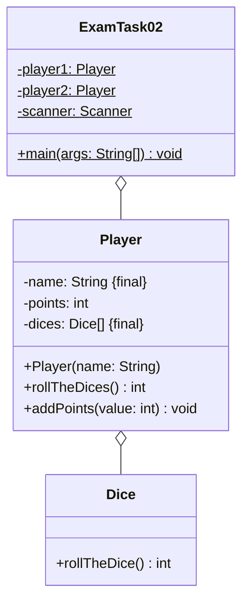

Erstelle die ausführbare Klasse `ExamTask02` anhand des abgebildeten
Klassendiagramms. Orientiere Dich bei der Konsolenausgabe am abgebildeten
Beispiel.

## Klassendiagramm



## Allgemeine Hinweise

- Aus Gründen der Übersicht werden im Klassendiagramm keine Getter und
  Object-Methoden dargestellt
- So nicht anders angegeben, sollen Konstruktoren, Setter, Getter sowie die
  Object-Methoden wie gewohnt implementiert werden

## Hinweis zur Klasse _Dice_

Die Methode `int rollTheDice()` soll mit einer gleichverteilten
Wahrscheinlichkeit einen Wert zwischen 1 und 6 zurückgeben.

## Hinweise zur Klasse _Player_

- Der Konstruktor soll 5 Würfel initialisieren
- Die Methode `int rollTheDices()` soll alle 5 Würfel werfen und die Summe der
  Würfelwerte zurückgeben
- Die Methode `void addPoints(value: int)` soll die Punkte des Spielers um den
  eingehenden Wert erhöhen

## Spielablauf

- Das Spiel soll aus 5 Runden bestehen
- Zu Beginn des Spiels sollen die Spieler ihre Namen eingeben können
- Zu Beginn jeder Runde soll jeder Spieler 5 Würfel werfen
- Anschließend soll der Spieler mit dem höheren Wurfwert die Differenz der
  beiden Wurfwerte als Punkte bekommen

## Beispielhafte Konsolenausgabe

```console
Spieler 1, bitte Namen eingeben: Hans
Spieler 2, bitte Namen eingeben: Peter

Runde - Wurfwert Hans - Wurfwert Peter - Differenz
1 - 16 - 22 - 6
2 - 21 - 23 - 2
3 - 17 - 19 - 2
4 - 26 - 13 - 13
5 - 19 - 15 - 4

Hans: 17 Punkte
Peter: 10 Punkte
```
