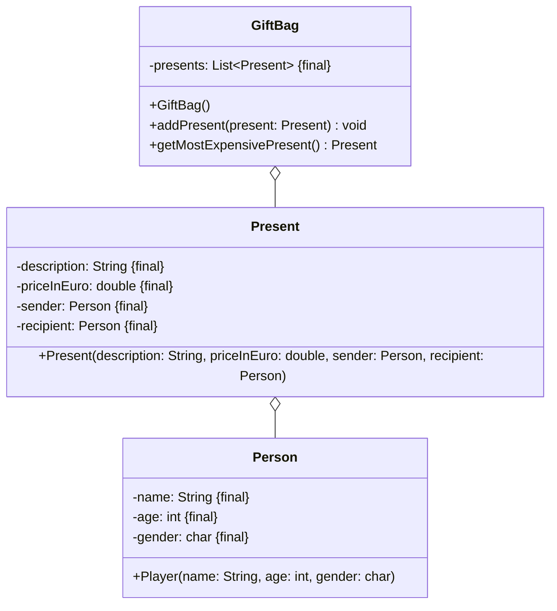

Setze das abgebildete Klassendiagramm vollständig um. Erstelle zum Testen eine
ausführbare Klasse.

## Klassendiagramm

## Allgemeine Hinweise

- Aus Gründen der Übersicht werden im Klassendiagramm keine Getter und
  Object-Methoden dargestellt
- So nicht anders angegeben, sollen Konstruktoren, Setter, Getter sowie die
  Object-Methoden wie gewohnt implementiert werden

## Hinweise zur Klasse _GiftBag_

- Die Methode `void addPresent(present: present)` soll der Geschenkeliste
  (`presents`) das eingehende Geschenk hinzufügen
- Die Methode `Present getMostExpensivePresent()` soll das teuerste Geschenk
  zurückgeben
