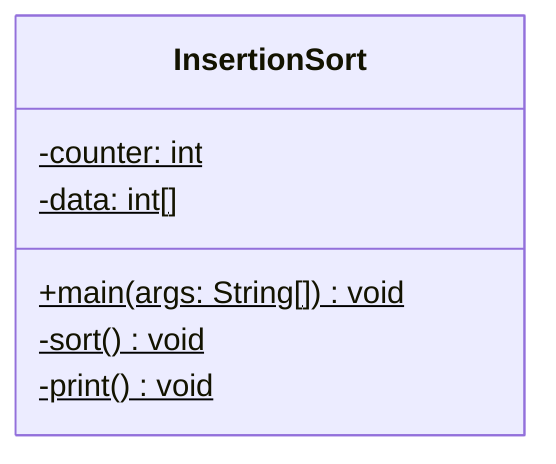
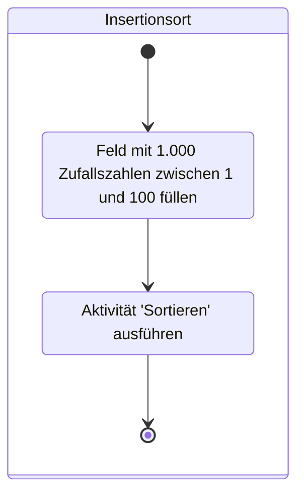
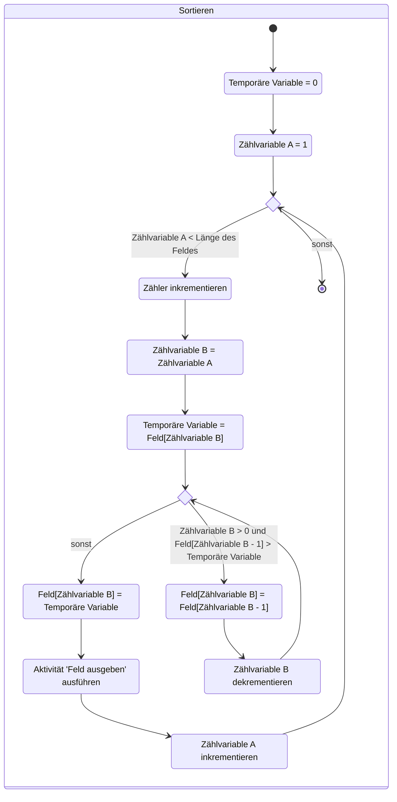
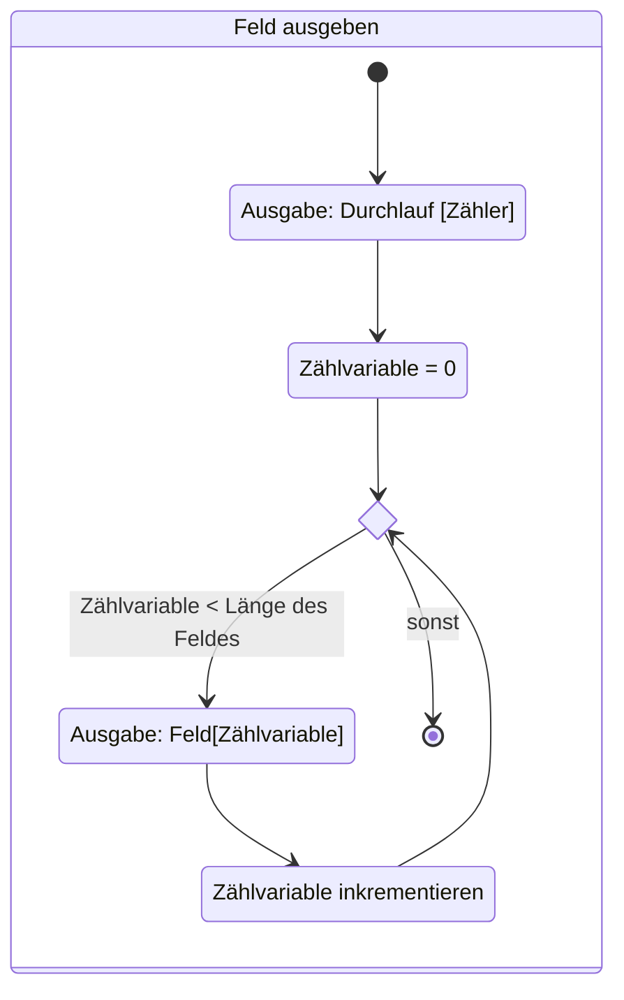

Erstelle die ausführbare Klasse `InsertionSort` anhand des abgebildeten
Klassendiagramms sowie anhand der abgebildeten Aktivitätsdiagramme.

## Klassendiagramm

## Aktivitätsdiagramm zur Methode _void main(args: String[])_

## Aktivitätsdiagramm zur Methode _void sort()_

## Aktivitätsdiagramm zur Methode _void print()_

