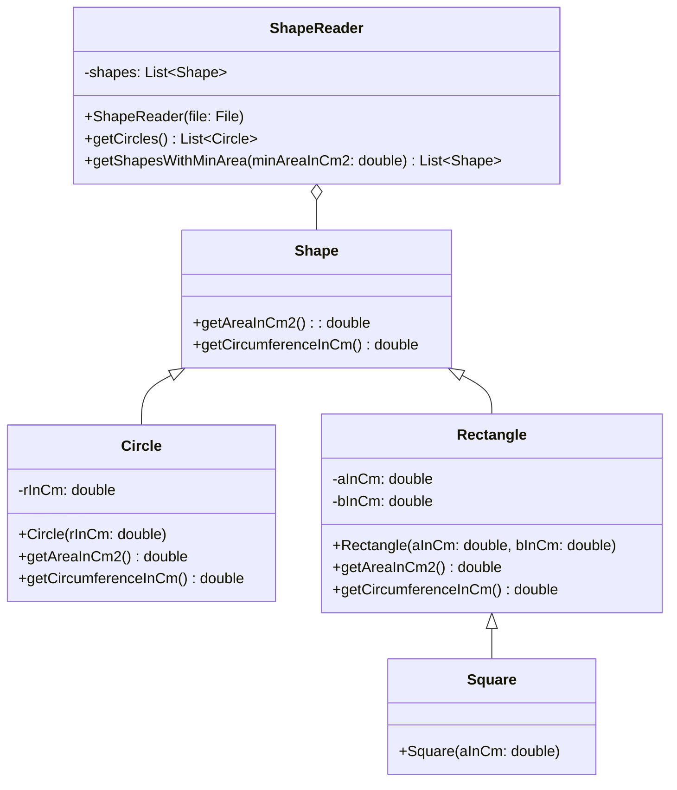

Setze das abgebildete Klassendiagramm vollständig um. Erstelle zum Testen eine
ausführbare Klasse.

## Klassendiagramm



## Allgemeine Hinweise

- Aus Gründen der Übersicht werden im Klassendiagramm keine Getter und
  Object-Methoden dargestellt
- So nicht anders angegeben, sollen Konstruktoren, Setter, Getter sowie die
  Object-Methoden wie gewohnt implementiert werden
- Die statische Konstante `PI` der Klasse `Math` stellt die Kreiszahl Pi dar

## Hinweise zur Klasse _Shape_

- Die Methode `double getAreaInCm2()` soll den Wert _0_ zurückgeben
- Die Methode `double getCircumferenceInCm()` soll den Wert _0_ zurückgeben

## Hinweise zur Klasse _Circle_

- Die Methode `double getAreaInCm2()` soll den Flächeninhalt gemäß der Formel
  _Pi * r * r_ berechnen und zurückgeben
- Die Methode `double getCircumferenceInCm()` soll den Umfang gemäß der Formel
  _2 * Pi * r_ berechnen und zurückgeben

## Hinweise zur Klasse _Rectangle_

- Die Methode `double getAreaInCm2()` soll den Flächeninhalt gemäß der Formel
  _a \* b_ berechnen und zurückgeben
- Die Methode `double getCircumferenceInCm()` soll den Umfang gemäß der Formel
  _2 * a + 2 * b_ berechnen und zurückgeben

## Hinweise zur Klasse _ShapeReader_

- Der Konstruktor soll der Formenliste (`shapes`) alle Formen der eingehenden
  Datei hinzufügen
- Die Methode `List<Circle> getCircles()` soll alle Kreise der Formenliste
  (`shapes`) zurückgeben
- Die Methode `List<Shape> getShapesWithMinArea(minAreaInCm2: double)` soll alle
  Formen der Formenliste (`shapes`) zurückgeben, die mindestens den eingehenden
  Flächeninhalt aufweisen

## Beispielhafter Aufbau der Formendatei

```
Circle;4
Square;5
Rectangle;3;4
Rectangle;1;7
Circle;2
Circle;3
```
