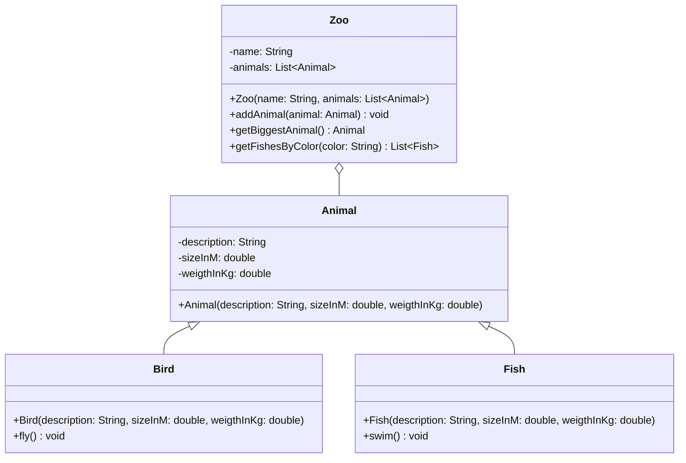

Setze das abgebildete Klassendiagramm vollständig um. Erstelle zum Testen eine
ausführbare Klasse.

## Klassendiagramm

## Allgemeine Hinweise

- Aus Gründen der Übersicht werden im Klassendiagramm keine Getter und
  Object-Methoden dargestellt
- So nicht anders angegeben, sollen Konstruktoren, Setter, Getter sowie die
  Object-Methoden wie gewohnt implementiert werden

## Hinweis zur Klasse _Bird_

Die Methode `void fly()` soll die Zeichenkette _flatter, flatter_ ausgeben.

## Hinweis zur Klasse _Fish_

Die Methode `void swim()` soll die Zeichenkette _schwimm, schwimm_ ausgeben.

## Hinweise zur Klasse _Zoo_

- Die Methode `void addAnimal(animal: Animal)` soll dem Zoo das eingehende Tier
  hinzufügen
- Die Methode `Animal getBiggestAnimal()` soll das größte Tier des Zoos
  zurückgeben
- Die Methode `List<Fish> getFishesByColor(color: String)` soll alle Fische des
  Zoos zur eingehenden Farbe zurückgeben
