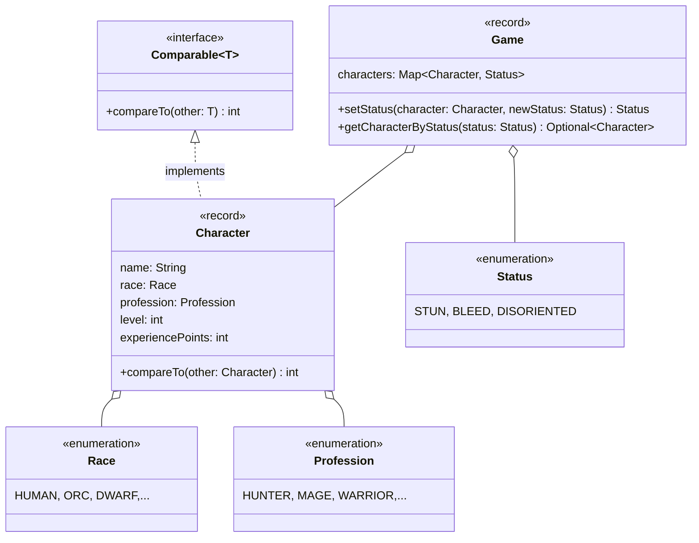

Setze das abgebildete Klassendiagramm vollständig um. Erstelle zum Testen eine
ausführbare Klasse und/oder eine Testklasse.

## Klassendiagramm

## Allgemeine Hinweise

- Aus Gründen der Übersicht werden im Klassendiagramm keine Getter und
  Object-Methoden dargestellt
- So nicht anders angegeben, sollen Konstruktoren, Setter, Getter sowie die
  Object-Methoden wie gewohnt implementiert werden

## Hinweis zur Klasse _Character_

Die Methode `int compareTo(other: Character)` soll so implementiert werden, dass
Spielfiguren absteigend nach ihrem Level und bei gleichem Level absteigend nach
ihren Erfahrungspunkten sortiert werden können.

## Hinweise zur Klasse _Game_

- Die Schlüssel-Werte-Paare des Assoziativspeichers `characters` beinhalten als
  Schlüssel eine Spielfigur sowie als Wert deren Status
- Die Methode `Status setStatus(character: Character, newStatus: Status)` soll
  den Status der eingehenden Spielfigur auf den eingehenden Wert setzen und den
  alten Status zurückgeben. Für den Fall, dass der neue Status dem alten Status
  entspricht, soll die Ausnahme `InvalidStatusException` ausgelöst werden
- Die Methode `Optional<Character> getCharacterByStatus(status: Status)` soll
  eine Spielfigur zum eingehenden Status zurückgeben
