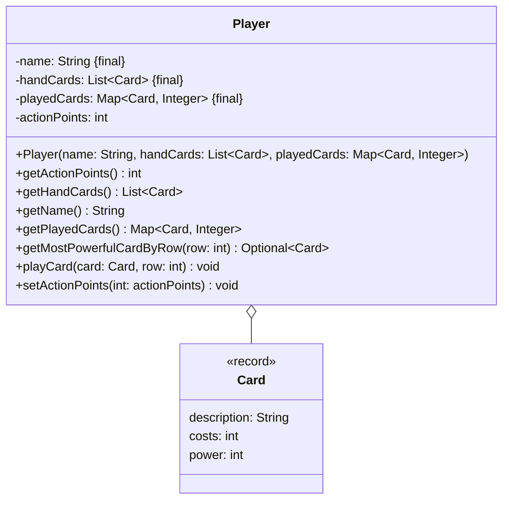

Setze das abgebildete Klassendiagramm vollständig um. Erstelle zum Testen eine
ausführbare Klasse und/oder eine Testklasse.

## Klassendiagramm

## Allgemeine Hinweise

- Aus Gründen der Übersicht werden im Klassendiagramm keine Getter und
  Object-Methoden dargestellt
- So nicht anders angegeben, sollen Konstruktoren, Setter, Getter sowie die
  Object-Methoden wie gewohnt implementiert werden

## Hinweis zur Klasse _Player_

- Die Schlüssel-Werte-Paare des Assoziativspeichers beinhalten als Schlüssel die
  ausgespielten Karten des Spielers sowie als Wert deren Reihe
- Die Methode `void playCard(card: Card, row: int)` soll die eingehende Karte
  ausspielen. Beim Ausspielen einer Karte soll diese aus den Handkarten entfernt
  und den ausgespielten Karten hinzugefügt werden. Zudem sollen die
  Aktionspunkte des Spielers um die Kosten der Karte reduziert werden. Für den
  Fall, dass die Karte nicht Teil der Handkarten ist, soll die Ausnahme
  `CardNotFoundException` ausgelöst werden und für den Fall, dass die
  Aktionspunkte des Spielers nicht ausreichen, die Ausnahme
  `NotEnoughActionPointsException`
- Die Methode `Optional<Card> getMostPowerfulCardByRow(row: int)` soll die
  stärkste ausgespielte Karte der eingehenden Reihe zurückgeben
