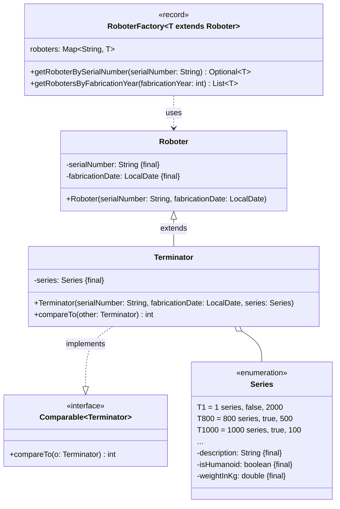

Setze das abgebildete Klassendiagramm vollständig um. Erstelle zum Testen eine
ausführbare Klasse und/oder eine Testklasse.

## Klassendiagramm

## Allgemeine Hinweise

- Aus Gründen der Übersicht werden im Klassendiagramm keine Getter und
  Object-Methoden dargestellt
- So nicht anders angegeben, sollen Konstruktoren, Setter, Getter sowie die
  Object-Methoden wie gewohnt implementiert werden

## Hinweis zur Klasse _Terminator_

Die Methode `int compareTo(other: Terminator)` soll so implementiert werden,
dass Terminatoren absteigend nach ihrem Gewicht sortiert werden können.

## Hinweise zur Klasse _RoboterFactory_

- Die Schlüssel-Werte-Paare des Assoziativspeichers `roboters` beinhalten als
  Schlüssel die Seriennummer sowie als Wert den dazugehörigen Roboter
- Die Methode `Optional<T> getRoboterBySerialNumber(serialNumber: String)` soll
  den Roboter zur eingehenden Seriennummer zurückgeben
- Die Methode `List<T> getRobotersByFabricationYear(fabricationYear: int)` soll
  alle Roboter zum eingehenden Fabrikationsjahr zurückgeben
