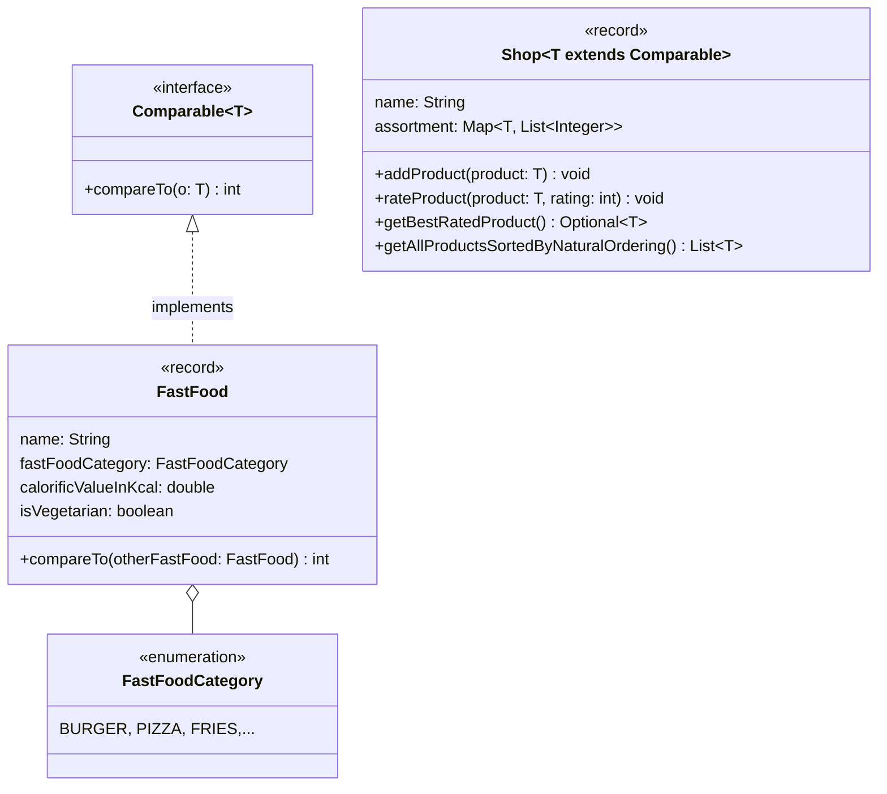

Setze das abgebildete Klassendiagramm vollständig um. Erstelle zum Testen eine
ausführbare Klasse und/oder eine Testklasse.

## Klassendiagramm

## Allgemeine Hinweise

- Aus Gründen der Übersicht werden im Klassendiagramm keine Getter und
  Object-Methoden dargestellt
- So nicht anders angegeben, sollen Konstruktoren, Setter, Getter sowie die
  Object-Methoden wie gewohnt implementiert werden

## Hinweis zur Klasse _FastFood_

Die Methode `int compareTo(otherFastFood: FastFood)` soll so implementiert
werden, dass damit Fast-Food absteigend nach den Kalorien sortiert werden kann.

## Hinweise zur Klasse _Shop_

- Das Sortiment des Shops (Attribut `assortment`) setzt sich auch Produkten und
  ihren Bewertungen zusammen
- Die Methode `void addProduct(product: T)` soll das eingehende Produkt zum
  Sortiment hinzufügen, allerdings nur für den Fall, dass das eingehende Produkt
  im Sortiment noch nicht vorhanden ist
- Die Methode `void rateProduct(product: T, rating: int)` soll dem eingehenden
  Produkt die eingehende Bewertung hinzufügen. Für den Fall, dass das eingehende
  Produkt nicht im Sortiment vorhanden ist, soll die Ausnahme
  `NoProductFoundException` ausgelöst werden und für den Fall, dass die
  eingehende Bewertung nicht im Bereich 1 bis 5 liegt, soll die Ausnahme
  `InvalidRatingException` ausgelöst werden
- Die Methode `Optional<T> getBestRatedProduct()` soll das Produkt mit der
  höchsten Durchschnittsbewertung als Optional zurückgeben
- Die Methode `List<T> getAllProductsSortedByNaturalOrdering()` soll alle
  Produkte sortiert nach ihrer natürlichen Ordnung zurückgeben
