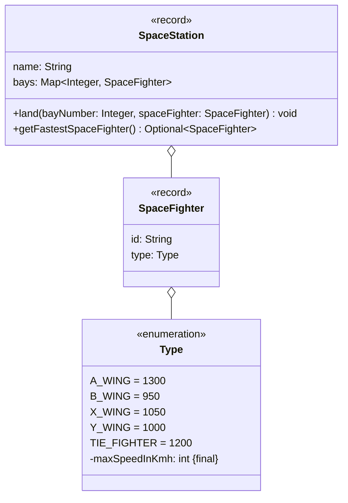

Setze das abgebildete Klassendiagramm vollständig um. Erstelle zum Testen eine
ausführbare Klasse und/oder eine Testklasse.

## Klassendiagramm

## Allgemeine Hinweise

- Aus Gründen der Übersicht werden im Klassendiagramm keine Getter und
  Object-Methoden dargestellt
- So nicht anders angegeben, sollen Konstruktoren, Setter, Getter sowie die
  Object-Methoden wie gewohnt implementiert werden

## Hinweise zur Klasse _SpaceStation_

- Die Methode `void land(bayNumber: Integer, spaceFighter: SpaceFighter)` soll
  den eingehenden Sternenjäger in der Bucht mit der eingehenden Buchtnummer
  landen lassen. Für den Fall, dass der eingehende Sternenjäger bereits gelandet
  ist (also bereits eine Bucht belegt), soll die Ausnahme
  `SpaceFighterAlreadyLandedException` ausgelöst werden und für den Fall, dass
  die Bucht bereits belegt ist, die Ausnahme `BayAlreadyLoadedException`
- Die Methode `Optional<SpaceFighter> getFastestSpaceFighter()` soll den
  schnellsten Sternenjäger der Raumstation als Optional zurückgeben
