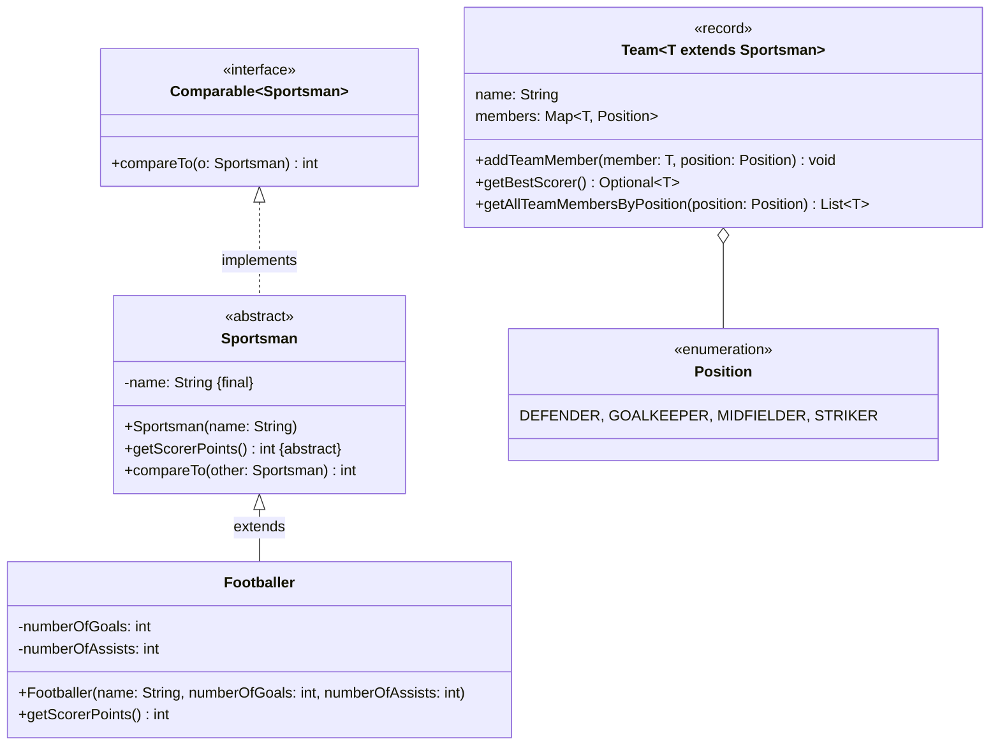

Setze das abgebildete Klassendiagramm vollständig um. Erstelle zum Testen eine
ausführbare Klasse und/oder eine Testklasse.

## Klassendiagramm

## Allgemeine Hinweise

- Aus Gründen der Übersicht werden im Klassendiagramm keine Getter und
  Object-Methoden dargestellt
- So nicht anders angegeben, sollen Konstruktoren, Setter, Getter sowie die
  Object-Methoden wie gewohnt implementiert werden

## Hinweise zur Klasse _Sportsman_

- Der Konstruktor soll alle Attribute initialisieren
- Die Methode `int compareTo(other: Sportsman)` soll so implementiert werden,
  dass Sportler absteigend nach ihren Scorer-Punkten sortiert werden können

## Hinweise zur Klasse _Team_

- Der Assoziativspeicher `members` beinhaltet als Schlüssel alle Mitglieder der
  Mannschaft sowie als Wert deren Position
- Die Methode `void addTeamMember(member: T, position: Position)` soll der
  Mannschaft den eingehenden Sportler als Mitglied mit der eingehenden Position
  hinzufügen. Für den Fall, dass der Sportler bereits Teil der Mannschaft ist,
  soll die Ausnahme `DuplicateKeyException` ausgelöst werden
- Die Methode `Optional<T> getBestScorer()` soll den Sportler mit den meisten
  Scorer-Punkten als Optional zurückgeben
- Die Methode `List<T> getAllTeamMembersByPosition(position: Position)` soll
  alle Sportler zur eingehenden Position als Liste zurückgeben
