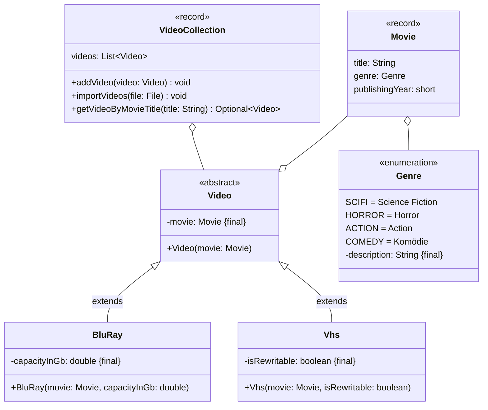

Setze das abgebildete Klassendiagramm vollständig um. Erstelle zum Testen eine
ausführbare Klasse und/oder eine Testklasse.

## Klassendiagramm



## Allgemeine Hinweise

- Aus Gründen der Übersicht werden im Klassendiagramm keine Getter und
  Object-Methoden dargestellt
- So nicht anders angegeben, sollen Konstruktoren, Setter, Getter sowie die
  Object-Methoden wie gewohnt implementiert werden

## Hinweise zur Klasse _VideoCollection_

- Die Methode `void addVideo(video: Video)` soll der Videoliste (`videos`) das
  eingehende Video hinzufügen
- Die Methode `void importVideos(file: File)` soll der Videoliste (`videos`) die
  Videos der eingehenden Datei hinzufügen. Die Ausnahme `FileNotFoundException`
  soll dabei weitergeleitet werden
- Die Methode `Optional<Video> getVideoByTitle(title: String)` soll das Video
  zum eingehenden Titel als Optional zurückgeben

## Beispielhafter Aufbau der Videodatei

```
The Matrix;SCIFI;1999;VHS;false
Evil Dead;HORROR;1981;BLURAY;25
```
