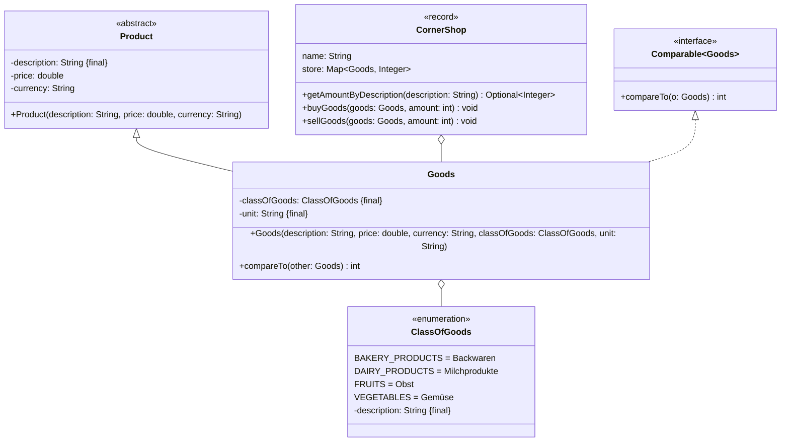

Setze das abgebildete Klassendiagramm vollständig um. Erstelle zum Testen eine
ausführbare Klasse und/oder eine Testklasse.

## Klassendiagramm

## Allgemeine Hinweise

- Aus Gründen der Übersicht werden im Klassendiagramm keine Getter und
  Object-Methoden dargestellt
- So nicht anders angegeben, sollen Konstruktoren, Setter, Getter sowie die
  Object-Methoden wie gewohnt implementiert werden

## Hinweis zur Klasse _Goods_

Die Methode `int compareTo(other: Goods)` soll so implementiert werden, dass
damit Waren aufsteigend nach ihrer Beschreibung sortiert werden können.

## Hinweise zur Klasse _CornerShop_

- Die Methode `Optional<Integer> getAmountByDescription(description: String)`
  soll die Anzahl Waren zur eingehenden Warenbeschreibung als Optional
  zurückgeben
- Die Methode `void buyGoods(goods: Goods, amount: int)` soll die eingehende
  Ware im Lager (`store`) um die eingehende Anzahl erhöhen
- Die Methode `void sellGoods(goods: Goods, amount: int)` soll die eingehende
  Ware im Lager (`store`) um die eingehende Anzahl reduzieren. Für den Fall,
  dass keine ausreichende Anzahl an Waren vorhanden ist, soll die Ausnahme
  `OutOfStockException` ausgelöst werden
