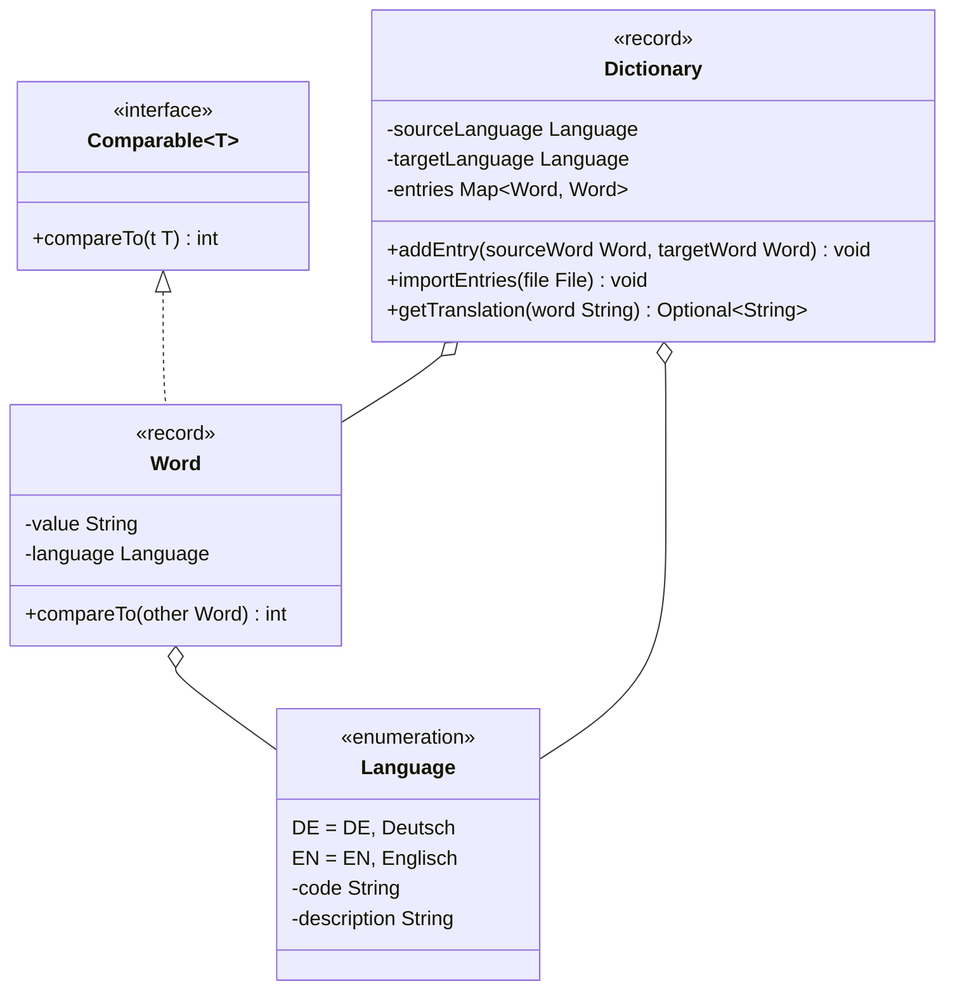

Setze das abgebildete Klassendiagramm vollständig um. Erstelle zum Testen eine
ausführbare Klasse und/oder eine Testklasse.

## Klassendiagramm



## Allgemeine Hinweise

- Aus Gründen der Übersicht werden im Klassendiagramm keine Getter und
  Object-Methoden dargestellt
- So nicht anders angegeben, sollen Konstruktoren, Setter, Getter sowie die
  Object-Methoden wie gewohnt implementiert werden

## Hinweis zur Klasse Word

Die Methode `int compareTo(other: Word)` soll so implementiert werden, dass
damit Wörter aufsteigend nach ihrem Wert sortiert werden können.

## Hinweise zur Klasse Dictionary

- Die Methode `void addEntry(sourceWord: Word, targetWord: Word)` soll den
  Einträgen des Wörterbuches (`entries`) die eingehenden Wörter als Eintrag
  hinzufügen. Für den Fall, dass die Sprache des ersten eingehenden Wortes nicht
  der Quellsprache (`sourceLanguage`) entspricht, oder die Sprache des zweiten
  eingehenden Wortes nicht der Zielsprache (`targetLanguage`) entspricht, soll
  die Ausnahme `InvalidLanguageException` ausgelöst werden
- Die Methode `void importEntries(file: File)` soll den Einträgen des
  Wörterbuches (`entries`) die Wörter der eingehenden Datei als Einträge
  hinzufügen. Die Ausnahme `FileNotFoundException` soll dabei weitergeleitet
  werden
- Die Methode `Optional<String> getTranslation(word: String)` soll die
  Übersetzung zur eingehenden Zeichenkette als Optional zurückgeben

## Beispielhafter Aufbau der Wörterdatei

```
DE;Haus;EN;House
DE;Maus;EN;Mouse
DE;Baum;EN;Tree
```
