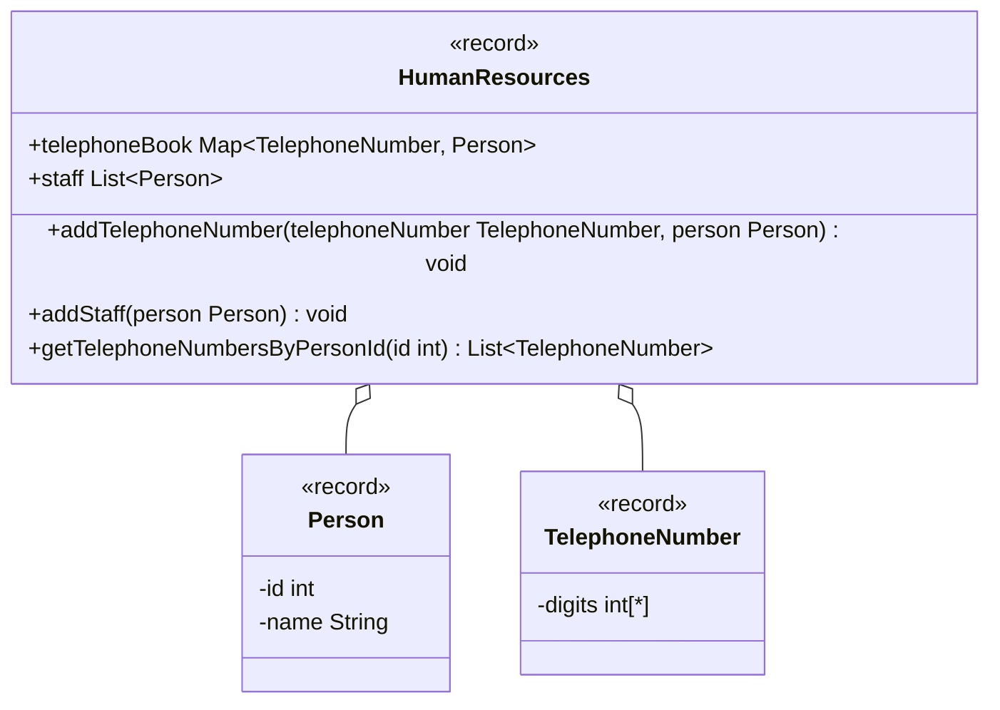

Setze das abgebildete Klassendiagramm vollständig um. Erstelle zum Testen eine
ausführbare Klasse und/oder eine Testklasse.

## Klassendiagramm

## Allgemeine Hinweise

- Aus Gründen der Übersicht werden im Klassendiagramm keine Getter und
  Object-Methoden dargestellt
- So nicht anders angegeben, sollen Konstruktoren, Setter, Getter sowie die
  Object-Methoden wie gewohnt implementiert werden

## Hinweise zur Klasse HumanResources

- Die Methode
  `void addTelephoneNumber(telephoneNumber: TelephoneNumber, person: Person)`
  soll dem Telefonbuch (`telephoneBook`) die eingehende Telefonnummer als
  Schlüssel sowie die eingehende Person als Wert hinzufügen
- Die Methode `void addStaff(person: Person)` soll der Personalliste (`staff`)
  die eingehende Person hinzufügen. Für den Fall, dass diese Person bereits in
  der Personalliste vorhanden ist, soll die Ausnahme `DuplicateException`
  ausgelöst werden
- Die Methode `List<TelephoneNumber> getTelephoneNumbersByPersonId(id: int)`
  soll alle Telefonnummern zur eingehenden Personennummer zurückgeben
