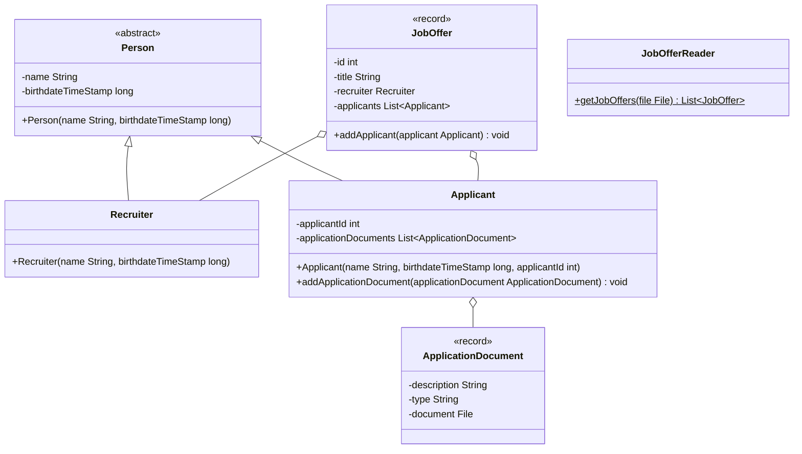

Setze das abgebildete Klassendiagramm vollständig um. Erstelle zum Testen eine
ausführbare Klasse und/oder eine Testklasse.

## Klassendiagramm



## Allgemeine Hinweise

- Aus Gründen der Übersicht werden im Klassendiagramm keine Getter und
  Object-Methoden dargestellt
- So nicht anders angegeben, sollen Konstruktoren, Setter, Getter sowie die
  Object-Methoden wie gewohnt implementiert werden

## Hinweis zur Klasse Applicant

Die Methode
`void addApplicationDocument(applicationDocument: ApplicationDocument)` soll den
Bewerbungsunterlagen (`applicationDocuments`) das eingehende Dokument
hinzufügen.

## Hinweis zur Klasse JobOffer

Die Methode `void addApplicant(applicant: Applicant)` soll der Bewerberliste
(`applicants`) den eingehenden Bewerber hinzufügen.

## Hinweis zur Klasse JobOfferReader

Die statische Methode `List<JobOffer> getJobOffers(file: File)` soll die
Stellenangebote der eingehenden Datei zurückgeben. Die Ausnahme
`FileNotFoundException` soll dabei weitergeleitet werden.

## Beispielhafter Aufbau der Stellenangebotsdatei

```
285;Senior Developer Java
392;Associate Consultant SAP
430;Expert Developer Java
```
