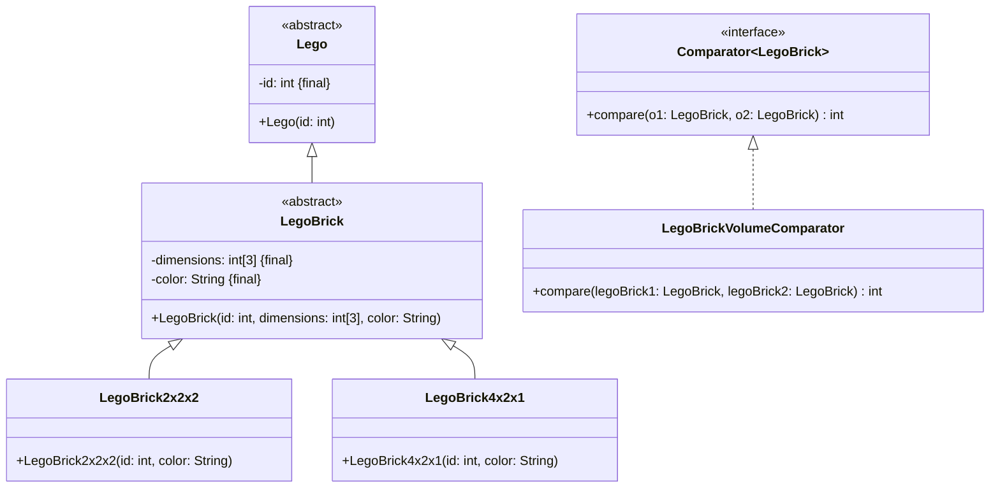

Setze das abgebildete Klassendiagramm vollständig um. Erstelle zum Testen eine
ausführbare Klasse und/oder eine Testklasse.

## Klassendiagramm

## Allgemeine Hinweise

- Aus Gründen der Übersicht werden im Klassendiagramm keine Getter und
  Object-Methoden dargestellt
- So nicht anders angegeben, sollen Konstruktoren, Setter, Getter sowie die
  Object-Methoden wie gewohnt implementiert werden

## Hinweis zur Klasse _LegoBrickVolumeComparator_

Die Methode `int compare(legoBrick1: LegoBrick, legoBrick2: LegoBrick)` soll so
implementiert werden, dass damit Lego-Bausteine aufsteigend nach ihrem Volumen
sortiert werden können.
