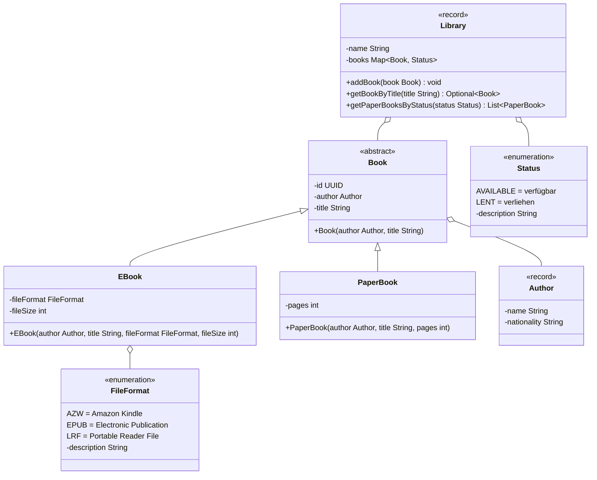

Setze das abgebildete Klassendiagramm vollständig um. Erstelle zum Testen eine ausführbare Klasse und/oder eine Testklasse.

## Klassendiagramm

## Allgemeine Hinweise

- Aus Gründen der Übersicht werden im Klassendiagramm keine Getter und Object-Methoden dargestellt
- So nicht anders angegeben, sollen Konstruktoren, Setter, Getter sowie die Object-Methoden wie gewohnt implementiert werden
- Die statische Methode `UUID randomUUID()` der Klasse `UUID` gibt eine zufällig erstellte UUID zurück

## Hinweis zur Klasse EBook

Der Konstruktor soll alle Attribute initialisieren. Für den Fall, dass die eingehende Dateigröße kleiner gleich Null ist, soll die Ausnahme `WrongFileSizeException` ausgelöst werden.

## Hinweise zur Klasse Library

- Die Methode `void addBook(book Book)` soll der Bücherliste (`books`) das eingehende Buch mit dem Status `verfügbar` hinzufügen
- Die Methode `Optional<Book> getBookByTitle(title String)` soll das Buch zum eingehenden Titel als Optional zurückgeben
- Die Methode `List<PaperBook> getPaperBooksByStatus(status Status)` soll alle gedruckten Bücher zum eingehenden Status zurückgeben
