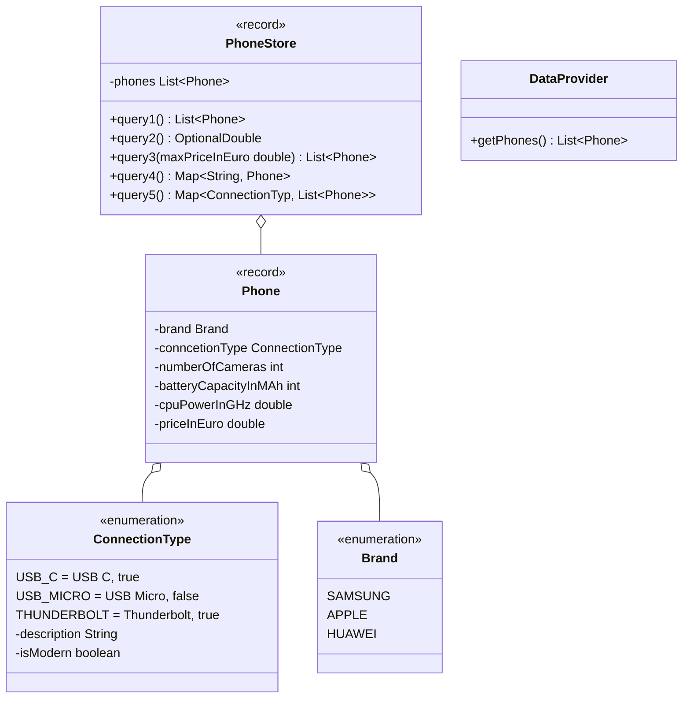

Setze das abgebildete Klassendiagramm vollständig um. Erstelle zum Testen eine ausführbare Klasse und/oder eine Testklasse.

## Klassendiagramm

## Hinweise zur Klasse PhoneStore

- Die Methode `List<Phone> query1()` soll die drei leistungsstärksten Smartphones mit 3 Kameras der Marke Huawei, absteigend nach dem Preis, zurückgeben
- Die Methode `OptionalDouble query2()` soll die durchschnittliche Anzahl Kameras aller Smartphones zurückgeben, die eine Akkukapazität von 2500 mAh oder mehr haben
- Die Methode `List<Phone> query3(,maxPriceInEuro double)` soll alle Smartphones aufsteigend nach Preis zurückgeben, die den eingehenden Höchstpreis nicht überschreiten, einen modernen Anschlusstyp haben und weniger als 2,4 GHz Leistung besitzen
- Die Methode `Map<String, Phone> query4()` soll alle Smartphones gruppiert nach der zusammengesetzten Zeichenkette aus Marke und Anschlusstyp zurückgeben
- Die Methode `Map<ConnectionType, Phone> query4()` soll alle Smartphones gruppiert nach dem Anschlusstyp zurückgeben
