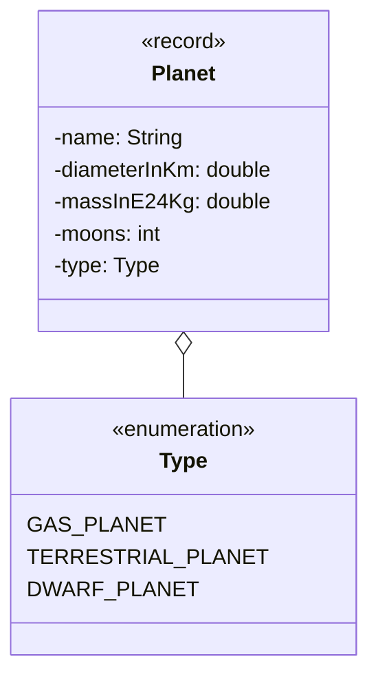

- Setze das abgebildete Klassendiagramm vollständig um
- Erstelle eine ausführbare Klasse, welche mit Hilfe der Java Stream API
  folgende Informationen auf der Konsole ausgibt:
  - alle Planeten mit mehr als 5 Monden
  - den durchschnittlichen Durchmesser aller Gasplaneten
  - alle Planeten absteigend sortiert nach der Masse
  - die Antwort auf die Frage, ob alle Planeten mindestens einen Mond besitzen
  - alle Planeten gruppiert nach ihrem Typ

## Klassendiagramm

## Allgemeine Hinweise

- Aus Gründen der Übersicht werden im Klassendiagramm keine Getter und
  Object-Methoden dargestellt
- So nicht anders angegeben, sollen Konstruktoren, Setter, Getter sowie die
  Object-Methoden wie gewohnt implementiert werden
