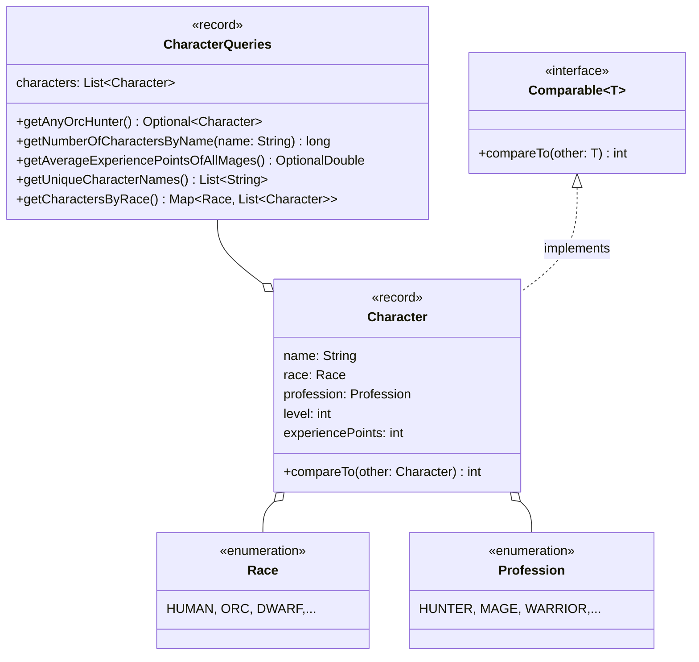

Setze das abgebildete Klassendiagramm vollständig um. Erstelle zum Testen eine
ausführbare Klasse und/oder eine Testklasse.

## Klassendiagramm

## Allgemeine Hinweise

- Aus Gründen der Übersicht werden im Klassendiagramm keine Getter und
  Object-Methoden dargestellt
- So nicht anders angegeben, sollen Konstruktoren, Setter, Getter sowie die
  Object-Methoden wie gewohnt implementiert werden

## Hinweise zur Klasse _CharacterQueries_

- Die Methode `Optional<Character> getAnyOrcHunter()` soll einen beliebigen
  Ork-Jäger zurückgeben
- Die Methode `long getNumberOfCharactersByName(name: String)` soll die Anzahl
  aller Spielfiguren zum eingehenden Namen zurückgeben
- Die Methode `OptionalDouble getAverageExperiencePointsOfAllMages()` soll die
  durchschnittlichen Erfahrungspunkte aller Magier zurückgeben
- Die Methode `List<String> getUniqueCharacterNames()` soll die Namen aller
  Spielfiguren ohne Dopplungen absteigend sortiert zurückgeben
- Die Methode `Map<Race, List<Character>> getCharactersByRace()` soll alle
  Spielfiguren gruppiert nach der Rasse zurückgeben
