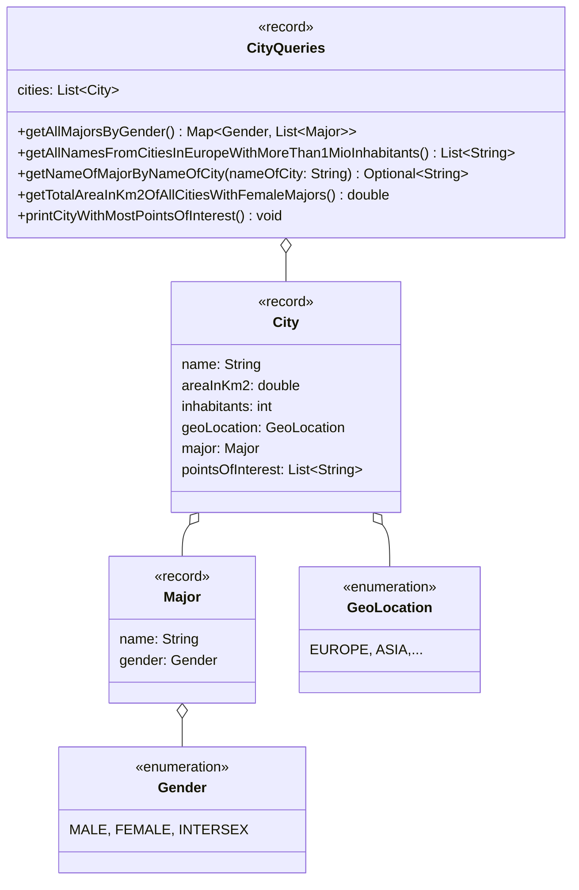

Setze das abgebildete Klassendiagramm vollständig um. Erstelle zum Testen eine
ausführbare Klasse und/oder eine Testklasse.

## Klassendiagramm

## Allgemeine Hinweise

- Aus Gründen der Übersicht werden im Klassendiagramm keine Getter und
  Object-Methoden dargestellt
- So nicht anders angegeben, sollen Konstruktoren, Setter, Getter sowie die
  Object-Methoden wie gewohnt implementiert werden

## Hinweise zur Klasse _CityQueries_

- Die Methode `Map<Gender, List<Major>> getAllMajorsByGender()` soll alle
  Bürgermeister gruppiert nach Geschlecht zurückgeben
- Die Methode
  `List<String> getAllNamesFromCitiesInEuropeWithMoreThan1MioInhabitants()` soll
  die Namen aller europäischen Städte mit mehr als 1 Million Einwohner
  zurückgeben
- Die Methode `Optional<String> getNameOfMajorByNameOfCity(nameOfCity: String)`
  soll den Namen des Bürgermeisters zum eingehenden Stadtnamen zurückgeben
- Die Methode `double getTotalAreaInKm2OfAllCitiesWithFemaleMajors()` soll die
  gesamte Fläche in km2 aller Städte mit weiblichen Bürgermeistern zurückgeben
- Die Methode `void printCityWithMostPointsOfInterest()` soll die Stadt mit den
  meisten Sehenswürdigkeiten in der Form _Stadtname (Anzahl Sehenswürdigkeiten)_
  ausgeben
