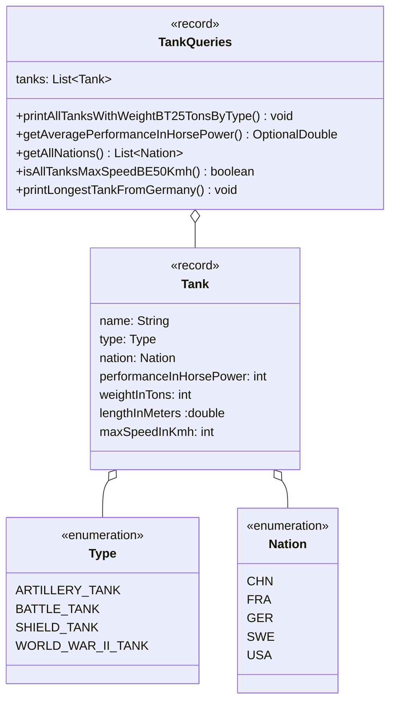

Setze das abgebildete Klassendiagramm vollständig um. Erstelle zum Testen eine
ausführbare Klasse und/oder eine Testklasse.

## Klassendiagramm

## Allgemeine Hinweise

- Aus Gründen der Übersicht werden im Klassendiagramm keine Getter und
  Object-Methoden dargestellt
- So nicht anders angegeben, sollen Konstruktoren, Setter, Getter sowie die
  Object-Methoden wie gewohnt implementiert werden

## Hinweise zur Klasse _TankQueries_

- Die Methode `void printAllTanksWithWeightBT25TonsByType()` soll alle Panzer
  mit einem Gewicht von mehr als 25 Tonnen gruppiert nach dem Typ in der Form
  _Typ: [Panzer, Panzer,...]_ ausgeben
- Die Methode `OptionalDouble getAveragePerformanceInHorsePower()` soll die
  durchschnittliche Leistung in Pfer- destärken aller Panzer zurückgeben
- Die Methode `List<Nation> getAllNations()` soll die Nationen aller Panzer
  zurückgeben
- Die Methode `boolean isAllTanksMaxSpeedBE50KMH()` soll zurückgeben, ob alle
  Kampfpanzer eine Höchstgeschwindigkeit von min. 50 km/h besitzen
- Die Methode `void printLongestTankFromGermany()` soll den Namen des längsten
  Panzers aus Deutschland auf der Konsole aus- geben. Gibt es keinen Panzer aus
  Deutschland, soll stattdessen der Wert `null` ausgegeben werden
