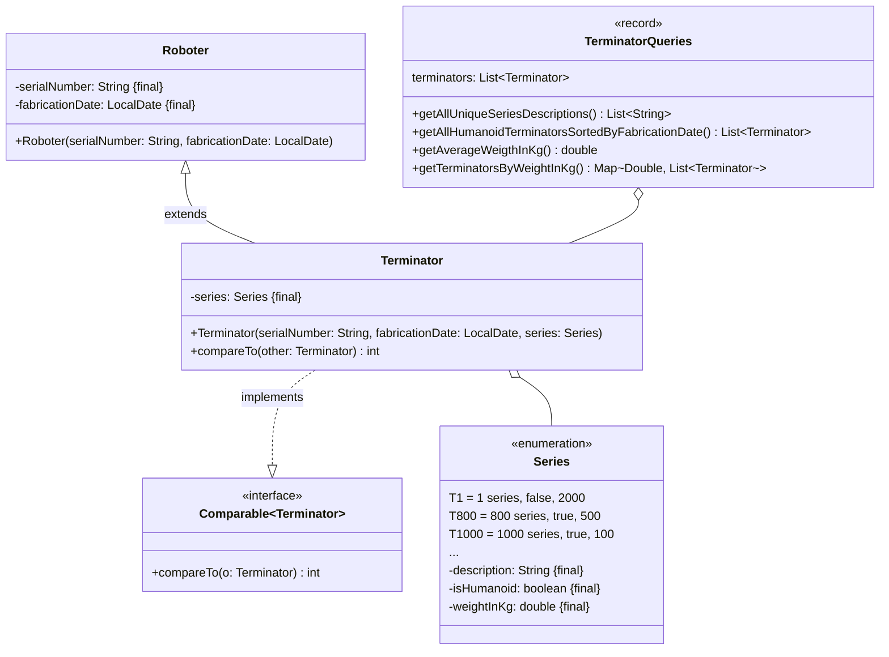

Setze das abgebildete Klassendiagramm vollständig um. Erstelle zum Testen eine
ausführbare Klasse und/oder eine Testklasse.

## Klassendiagramm

## Allgemeine Hinweise

- Aus Gründen der Übersicht werden im Klassendiagramm keine Getter und
  Object-Methoden dargestellt
- So nicht anders angegeben, sollen Konstruktoren, Setter, Getter sowie die
  Object-Methoden wie gewohnt implementiert werden

## Hinweise zur Klasse _TerminatorQueries_

- Die Methode `List<String> getAllUniqueSeriesDescriptions()` soll die
  Serienbeschreibungen aller Terminatoren ohne Dopplungen zurückgeben
- Die Methode
  `List<Terminator> getAllHumanoidTerminatorsSortedByFabricationDate()` soll
  alle menschenähnlichen Terminatoren absteigend sortiert nach ihrem
  Fabrikationsdatum zurückgeben
- Die Methode `double getAverageWeigthInKg()` soll das durchschnittliche Gewicht
  aller Terminatoren zurückgeben. Für den Fall, dass kein durchschnittliches
  Gewicht berechnet werden kann, soll die Ausnahme `Exception` ausgelöst werden
- Die Methode `Map<Double, List<Terminator>> getTerminatorsByWeightInKg()` soll
  alle Terminatoren gruppiert nach ihrem Gewicht zurückgeben
