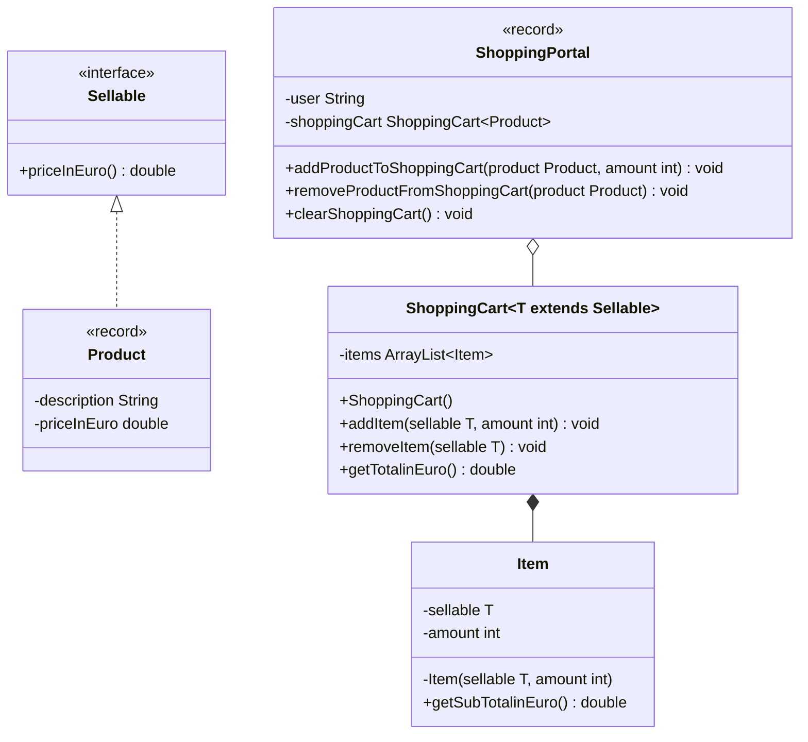

Setze das abgebildete Klassendiagramm vollständig um. Erstelle zum Testen eine ausführbare Klasse und/oder eine Testklasse.

## Klassendiagramm

## Allgemeine Hinweise

- Aus Gründen der Übersicht werden im Klassendiagramm keine Getter und Object-Methoden dargestellt
- So nicht anders angegeben, sollen Konstruktoren, Setter, Getter sowie die Object-Methoden wie gewohnt implementiert werden

## Hinweis zur Klasse Item

Die Methode `double getSubTotalInEuro()` soll die Zwischensumme des Warenkorbeintrags gemäß der Formel _Produktpreis \* Anzahl_ zurückgeben.

## Hinweise zur Klasse ShoppingCart

- Die Methode `void addItem(sellable T, amount int)` soll den Einträgen des Warenkorbs (`items`) das eingehende verkäufliche Objekt und die eingehende Anzahl als 
  Eintrag hinzufügen
- Die Methode `void removeItem(sellable T)` soll das eingehende verkäufliche Objekt aus den Einträgen des Warenkorbs (`items`) entfernen
- Die Methode `double getTotalInEuro()` soll die Gesamtsumme des Warenkorbs zurückgeben

## Hinweise zur Klasse ShoppingPortal

- Die Methode `void addProductToShoppingCart(product Product, amount int)` soll dem Warenkorb (`shoppingCart`) das eingehende Produkt und die eingehende Anzahl als
  Eintrag hinzufügen
- Die Methode `void removeProductFromShoppingCart(product Product)` soll das eingehende Produkt aus dem Warenkorb (`shoppingCart`) entfernen
- Die Methode `void clearShoppingCart()` soll alle Einträge des Warenkorbs (`shoppingCart`) entfernen
