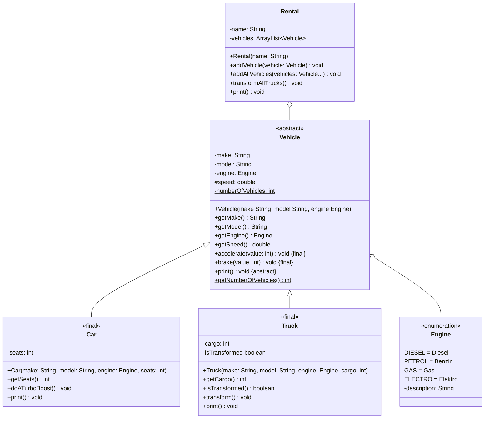

import Exercise from '@site/src/components/Exercise';

Passe die Klassen `Vehicle`, `Car` und `Truck` aus Übungsaufgabe
[Polymorphy03](../polymorphy/polymorphy03) anhand des abgebildeten
Klassendiagramms an.

## Klassendiagramm

<Exercise pullRequest="45" branchSuffix="abstract-and-final/01" />
