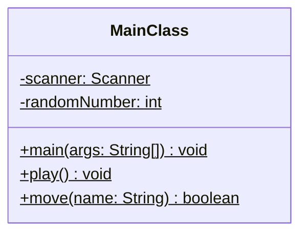
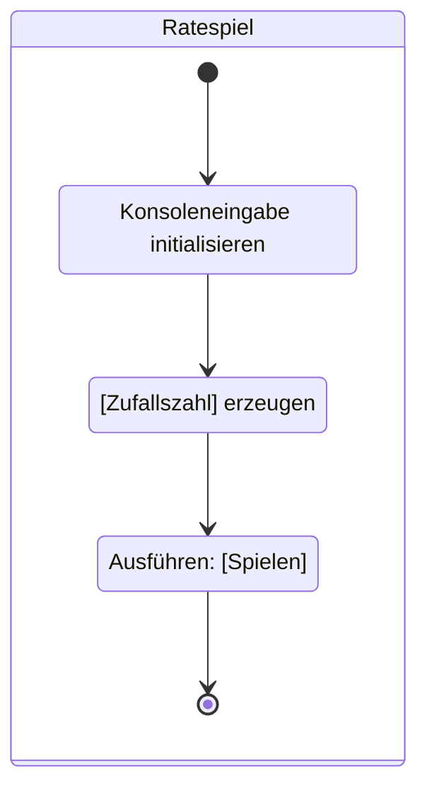
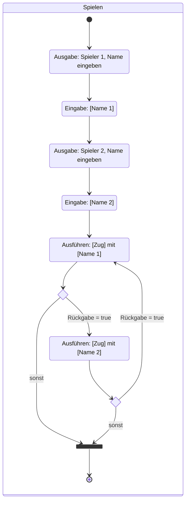
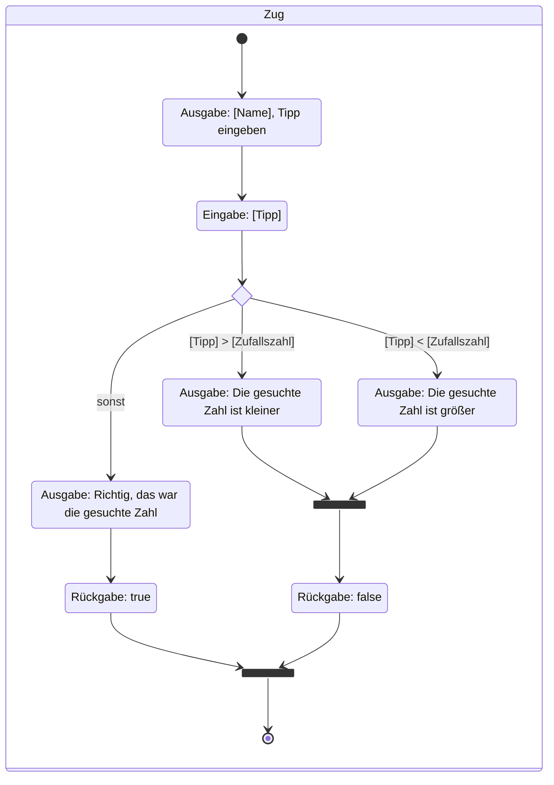

import Exercise from '@site/src/components/Exercise';

Erstelle die Klasse `MainClass` anhand des abgebildeten Klassendiagramms sowie
den abgebildeten Aktivitätsdiagrammen.

## Klassendiagramm

## Aktivitätsdiagramm zur Methode _void main(args: String[])_

## Aktivitätsdiagramm zur Methode _void play()_

## Aktivitätsdiagramm zur Methode _boolean move(name: String)_

<Exercise pullRequest="35" branchSuffix="activity-diagrams/01" />
