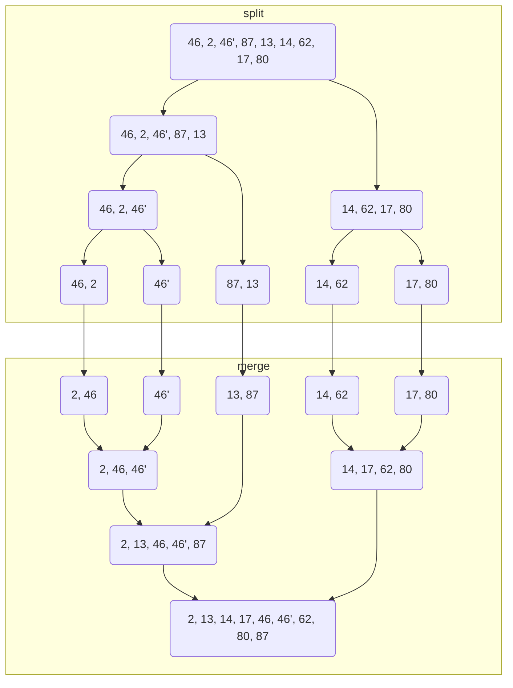
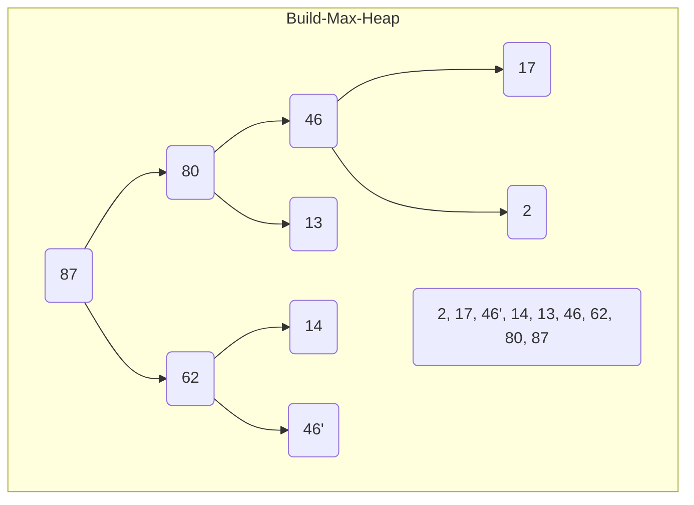
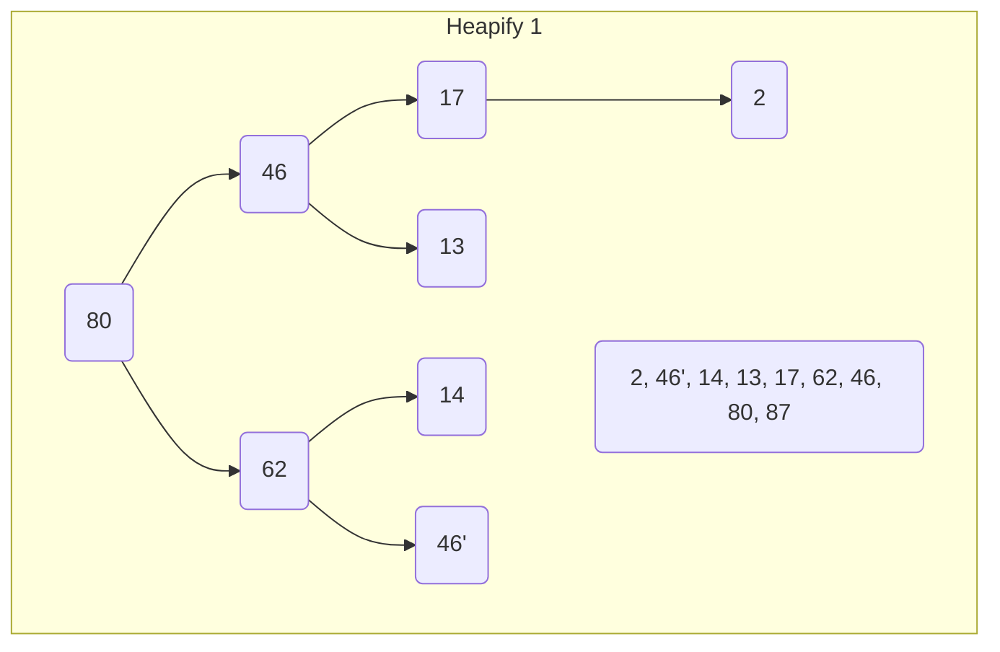
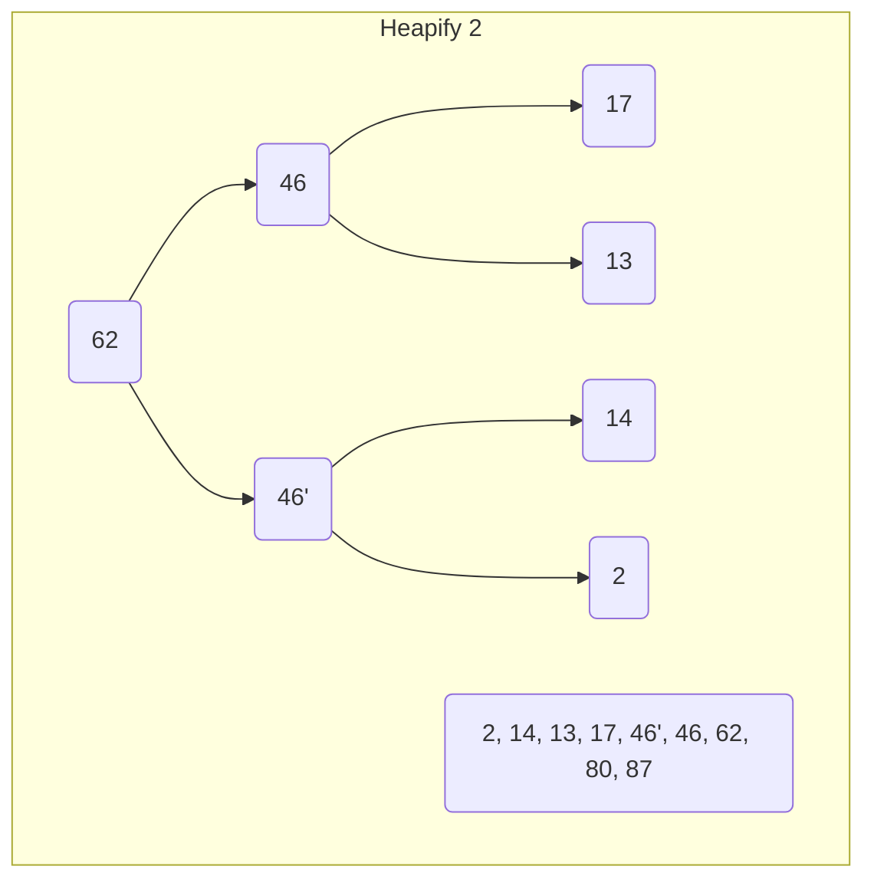
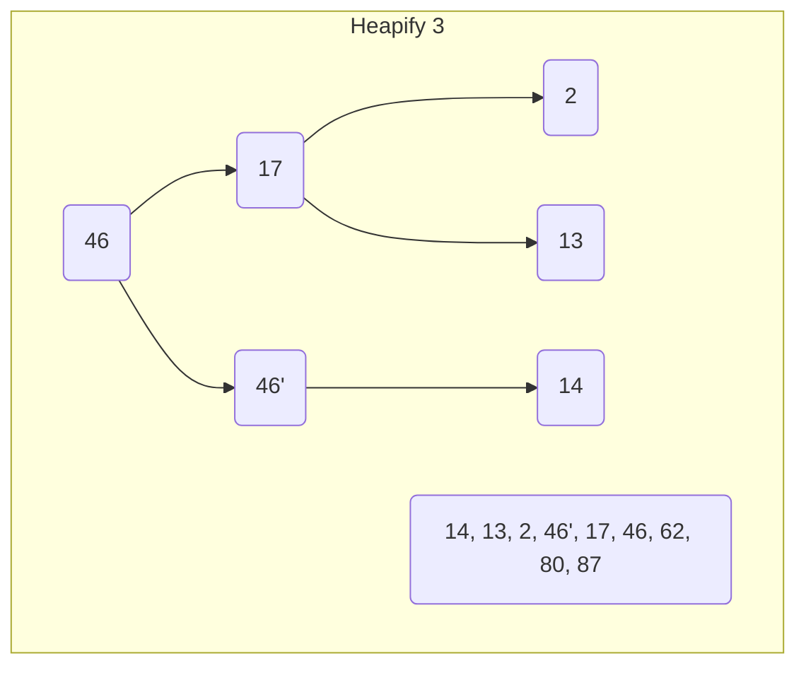
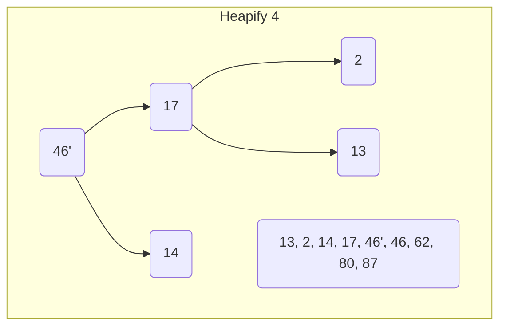
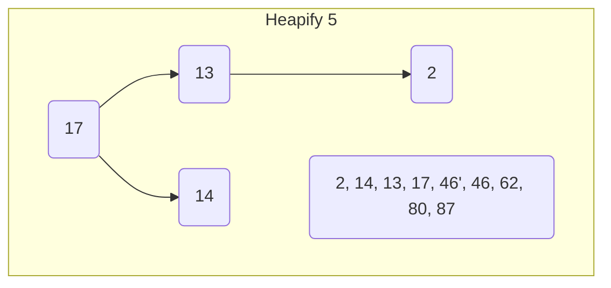
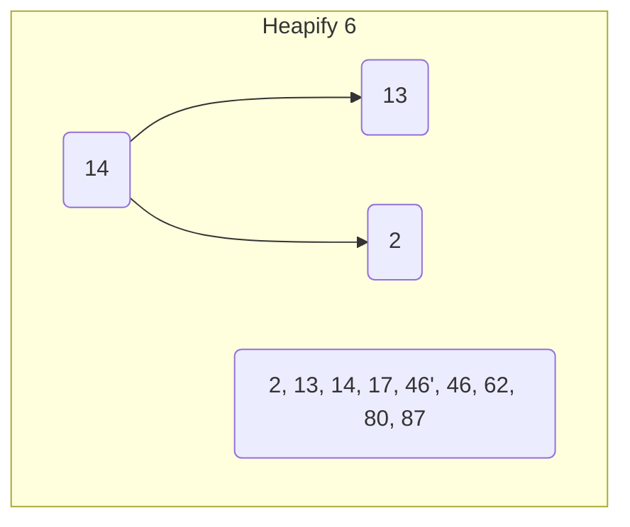
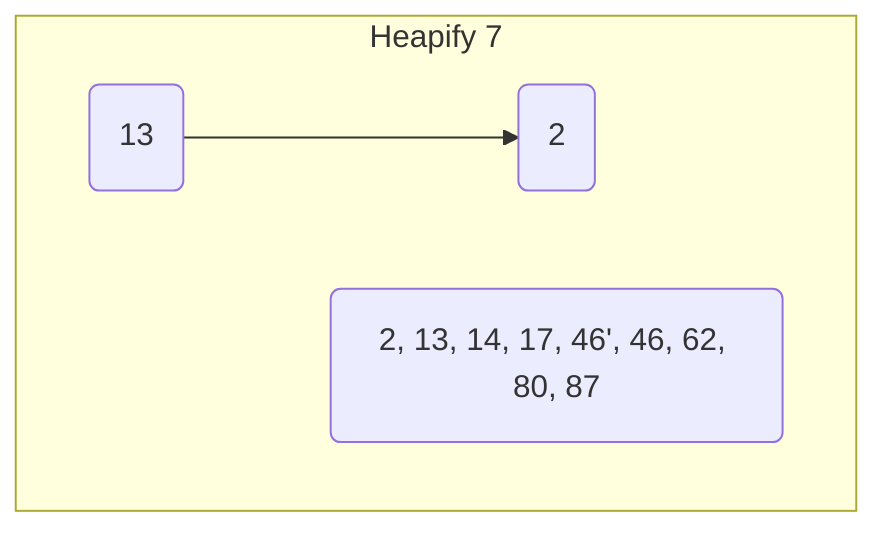

import Tabs from '@theme/Tabs';
import TabItem from '@theme/TabItem';

Sortiere die Zahlenfolge `46, 2, 46', 87, 13, 14, 62, 17, 80` unter Verwendung
des Bubblesort, des Insertionsort, des Selectionsort, des Quicksort, des
Mergesort und des Heapsorts.

 <Tabs>
  <TabItem value="a" label="-" default>

  </TabItem>
  <TabItem value="b" label="Bubblesort">

| Index | 0   | 1      | 2      | 3      | 4       | 5       | 6       | 7       | 8       | 9       |
| ----- | --- | ------ | ------ | ------ | ------- | ------- | ------- | ------- | ------- | ------- |
| 0     | 46  | 2      | 2      | 2      | 2       | 2       | 2       | 2       | 2       | **2**   |
| 1     | 2   | 46     | 46     | 13     | 13      | 13      | 13      | 13      | **13**  | **13**  |
| 2     | 46' | 46'    | 13     | 14     | 14      | 14      | 14      | **14**  | **14**  | **14**  |
| 3     | 87  | 13     | 14     | 46     | 17      | 17      | **17**  | **17**  | **17**  | **17**  |
| 4     | 13  | 14     | 46'    | 17     | 46      | **46**  | **46**  | **46**  | **46**  | **46**  |
| 5     | 14  | 62     | 17     | 46'    | **46'** | **46'** | **46'** | **46'** | **46'** | **46'** |
| 6     | 62  | 17     | 62     | **62** | **62**  | **62**  | **62**  | **62**  | **62**  | **62**  |
| 7     | 17  | 80     | **80** | **80** | **80**  | **80**  | **80**  | **80**  | **80**  | **80**  |
| 8     | 80  | **87** | **87** | **87** | **87**  | **87**  | **87**  | **87**  | **87**  | **87**  |

  </TabItem>
  <TabItem value="c" label="Insertionsort">

| Index | 0   | 1      | 2      | 3       | 4       | 5       | 6       | 7       | 8       | 9       |
| ----- | --- | ------ | ------ | ------- | ------- | ------- | ------- | ------- | ------- | ------- |
| 0     | 46  | **46** | **2**  | **2**   | **2**   | **2**   | **2**   | **2**   | **2**   | **2**   |
| 1     | 2   | 2      | **46** | **46**  | **46**  | **13**  | **13**  | **13**  | **13**  | **13**  |
| 2     | 46' | 46'    | 46'    | **46'** | **46'** | **46**  | **14**  | **14**  | **14**  | **14**  |
| 3     | 87  | 87     | 87     | 87      | **87**  | **46'** | **46**  | **46**  | **17**  | **17**  |
| 4     | 13  | 13     | 13     | 13      | 13      | **87**  | **46'** | **46'** | **46**  | **46**  |
| 5     | 14  | 14     | 14     | 14      | 14      | 14      | **87**  | **62**  | **46'** | **46'** |
| 6     | 62  | 62     | 62     | 62      | 62      | 62      | 62      | **87**  | **62**  | **62**  |
| 7     | 17  | 17     | 17     | 17      | 17      | 17      | 17      | 17      | **87**  | **80**  |
| 8     | 80  | 80     | 80     | 80      | 80      | 80      | 80      | 80      | 80      | **87**  |

  </TabItem>
  <TabItem value="d" label="Selectionsort">

| Index | 0   | 1     | 2      | 3      | 4      | 5      | 6       | 7       | 8       | 9       |
| ----- | --- | ----- | ------ | ------ | ------ | ------ | ------- | ------- | ------- | ------- |
| 0     | 46  | **2** | **2**  | **2**  | **2**  | **2**  | **2**   | **2**   | **2**   | **2**   |
| 1     | 2   | 46    | **13** | **13** | **13** | **13** | **13**  | **13**  | **13**  | **13**  |
| 2     | 46' | 46'   | 46     | **14** | **14** | **14** | **14**  | **14**  | **14**  | **14**  |
| 3     | 87  | 87    | 46'    | 46     | **17** | **17** | **17**  | **17**  | **17**  | **17**  |
| 4     | 13  | 13    | 87     | 46'    | 46     | **46** | **46**  | **46**  | **46**  | **46**  |
| 5     | 14  | 14    | 14     | 87     | 46'    | 46'    | **46'** | **46'** | **46'** | **46'** |
| 6     | 62  | 62    | 62     | 62     | 87     | 87     | 87      | **62**  | **62**  | **62**  |
| 7     | 17  | 17    | 17     | 17     | 62     | 62     | 62      | 87      | **80**  | **80**  |
| 8     | 80  | 80    | 80     | 80     | 80     | 80     | 80      | 80      | 87      | **87**  |

  </TabItem>
  <TabItem value="e" label="Quicksort">

| Index | 0    | 1     | 2      | 3      | 4      | 5       | 6       | 7       |
| ----- | ---- | ----- | ------ | ------ | ------ | ------- | ------- | ------- |
| 0     | 46   | [13]  | **2**  | **2**  | **2**  | **2**   | **2**   | **2**   |
| 1     | 2    | 2     | **13** | **13** | **13** | **13**  | **13**  | **13**  |
| 2     | 46'  | _46'_ | 46'    | **14** | **14** | **14**  | **14**  | **14**  |
| 3     | 87   | _87_  | 87     | 87     | [17]   | **17**  | **17**  | **17**  |
| 4     | [13] | _46_  | 46     | 46     | 46'    | **46'** | **46'** | **46'** |
| 5     | 14   | _14_  | [14]   | [46']  | _46_   | 46      | **46**  | **46**  |
| 6     | 62   | _62_  | 62     | 62     | _62_   | [62]    | **62**  | **62**  |
| 7     | 17   | _17_  | 17     | 17     | _87_   | 87      | _87_    | **80**  |
| 8     | 80   | _80_  | 80     | 80     | _80_   | 80      | _80_    | **87**  |

| Durchlauf | l   | r   | m   | d[m] | i   | j   | l-j | i-r |
| --------- | --- | --- | --- | ---- | --- | --- | --- | --- |
| 1         | 0   | 8   | 4   | 13   | 2   | 1   | 0-1 | 2-8 |
| 2         | 0   | 1   | 0   | 13   | 1   | 0   | 0-0 | 1-1 |
| 3         | 2   | 8   | 5   | 14   | 3   | 2   | 2-2 | 3-8 |
| 4         | 3   | 8   | 5   | 46'  | 5   | 4   | 3-4 | 5-8 |
| 5         | 3   | 4   | 3   | 17   | 4   | 2   | 3-2 | 4-4 |
| 6         | 5   | 8   | 6   | 62   | 7   | 5   | 5-5 | 7-8 |
| 7         | 7   | 8   | 7   | 87   | 8   | 7   | 7-7 | 8-8 |

  </TabItem>
  <TabItem value="f" label="Mergesort">

  </TabItem>
  <TabItem value="g" label="Heapsort">

  </TabItem>
</Tabs>
