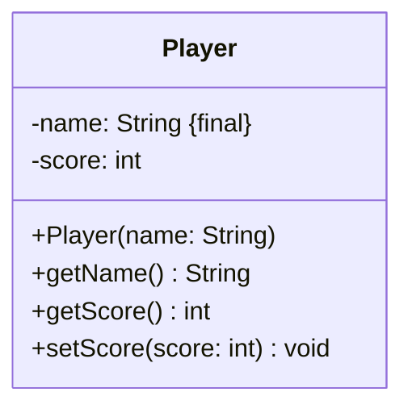

import Exercise from '@site/src/components/Exercise';

- Erstelle die Klasse `Player` anhand des abgebildeten Klassendiagramms
- Erstelle eine ausführbare Klasse, welche ein einfaches Würfelduell zwischen 2
  Spielern simuliert:
  - Würfelwert von Spieler 1 > Würfelwert von Spieler 2: Spieler 1 gewinnt
  - Würfelwert von Spieler 1 < Würfelwert von Spieler 2: Spieler 2 gewinnt
  - Würfelwert von Spieler 1 = Würfelwert von Spieler 2: Unentschieden
- Verwende die Klasse bereitgestellte Klasse Dice.

## Klassendiagramm



## Hinweis zur Klasse _Player_

Der Konstruktor soll den Namen initialisieren.

## Konsolenausgabe

```console
Hans würfelt eine 2
Lisa würfelt eine 3
Lisa gewinnt
```

## Hinweis

Verwende die Klasse `Dice` aus Übungsaufgabe [OO03](../oo/oo03)

<Exercise pullRequest="36" branchSuffix="class-diagrams/01" />
