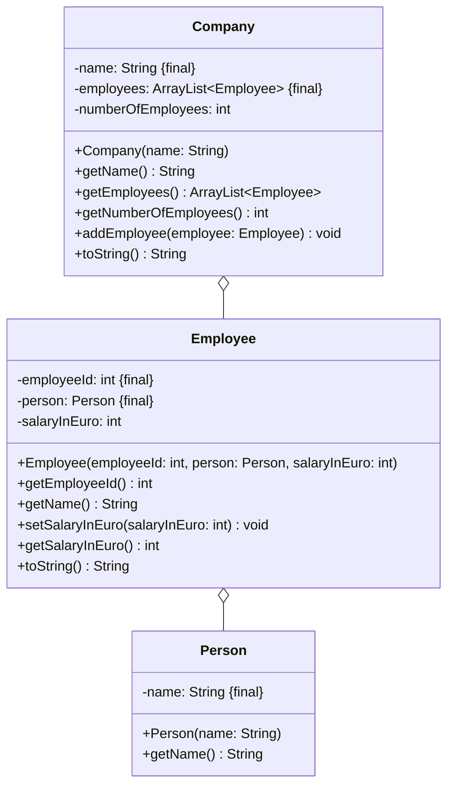

import Exercise from '@site/src/components/Exercise';

- Erstelle die Klassen `Company`, `Employee` und `Person` anhand des
  abgebildeten Klassendiagramms
- Erstelle eine ausführbare Klasse, welche ein Unternehmen mit mehreren
  Mitarbeitern erzeugt und auf der Konsole ausgibt

## Klassendiagramm



## Hinweis zur Klasse _Person_

- Der Konstruktor soll alle Attribute initialisieren
- Die Methode `String getName()` soll den Namen der Person zurückgeben

## Hinweise zur Klasse _Employee_

- Der Konstruktor soll alle Attribute initialisieren
- Die Methode `int getEmployeeId()` soll die Id des Mitarbeiters zurückgeben
- Die Methode String getName()` soll den Namen des Mitarbeiters zurückgeben
- Die Methode `void setSalaryInEuro(salaryInEuro: int)` soll das Gehalt des
  Mitarbeiters festlegen
- Die Methode `int getSalaryInEuro()` soll das Gehalt des Mitarbeiters
  zurückgeben
- Die Methode `String toString()` soll alle Attribute in der Form
  _Mitarbeiternummer - Name - Gehalt_ zurückgeben

## Hinweise zur Klasse _Company_

- Der Konstruktor soll alle Attribute initialisieren
- Die Methode `String getName()` soll den Namen der Firma zurückgeben
- Die Methode `ArrayList<Employee> getEmployees()` soll die Mitarbeiterliste
  zurückgeben
- Die Methode `int getNumberOfEmployees()` soll die Anzahl der Mitarbeiter
  zurückgeben
- Die Methode `void addEmployee(employee: Employee)` soll den eingehenden
  Mitarbeiter der Mitarbeiterliste hinzufügen
- Die Methode `String toString()` soll alle Attribute in der Form _Firmenname
  (Mitarbeiteranzahl)\nMitarbeiter\n..._ zurückgeben

## Konsolenausgabe

```console
Maier GmbH (5 Mitarbeiter)
1 - Max Schmid - 50000€
2 - Hans Müller - 75000€
3 - Lisa Meier - 40000€
4 - Peter Schneider - 55000€
5 - Miriam Albers - 90000€
```

<Exercise pullRequest="39" branchSuffix="class-diagrams/04" />
