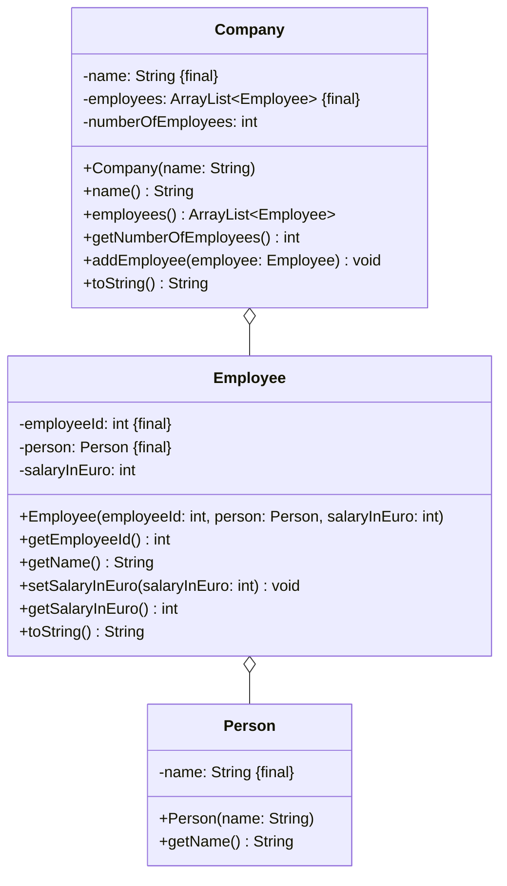

import Exercise from '@site/src/components/Exercise';

- Erstelle die Klassen `Company`, `Employee` und `Person` anhand des
  abgebildeten Klassendiagramms
- Erstelle eine ausführbare Klasse, welche ein Unternehmen mit mehreren
  Mitarbeitern erzeugt und auf der Konsole ausgibt

## Klassendiagramm



## Hinweis zur Klasse _Person_

Der Konstruktor soll den Namen initialisieren.

## Hinweise zur Klasse _Employee_

- Der Konstruktor soll alle Attribute initialisieren
- Die Methode `String name()` soll den Namen des Mitarbeiters zurückgeben

## Hinweise zur Klasse _Company_

- Der Konstruktor soll den Namen sowie die Mitarbeiterliste initialisieren
- Die Methode `void addEmployee(employee: Employee)` soll der Mitarbeiterliste
  einen Mitarbeiter hinzufügen

## Konsolenausgabe

```console
Maier GmbH (5 Mitarbeiter)
1 - Max Schmid - 50000€
2 - Hans Müller - 75000€
3 - Lisa Meier - 40000€
4 - Peter Schneider - 55000€
5 - Miriam Albers - 90000€
```

<Exercise pullRequest="39" branchSuffix="class-diagrams/04" />
