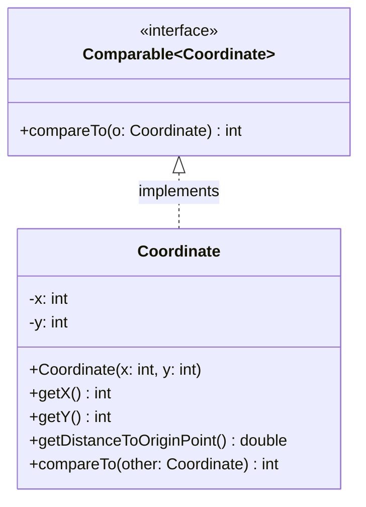

import Exercise from '@site/src/components/Exercise';

- Erstelle die Klasse `Coordinate` anhand des abgebildeten Klassendiagramms
- Erstelle eine ausführbare Klasse, welche eine Koordinatenliste mit mehreren
  Koordinaten erzeugt, diese sortiert und anschließend auf der Konsole ausgibt

## Klassendiagramm

## Hinweise zur Klasse _Coordinate_

- Die Methode `double getDistanceToOriginPoint()` soll die Distanz der
  Koordinate zum Nullpunkt zurückgeben
- Die Methode `int compareTo(other: Coordinate)` soll so implementiert werden,
  dass Koordinaten aufsteigend nach ihrem Abstand zum Nullpunkt sortiert werden
  können

## Hinweis

Die statische Methode `double hypot(x: double, y: double)` der Klasse `Math`
berechnet die Hypotenuse zum eingehenden X- und Y-Wert.

<Exercise branchSuffix="comparators-01" />
