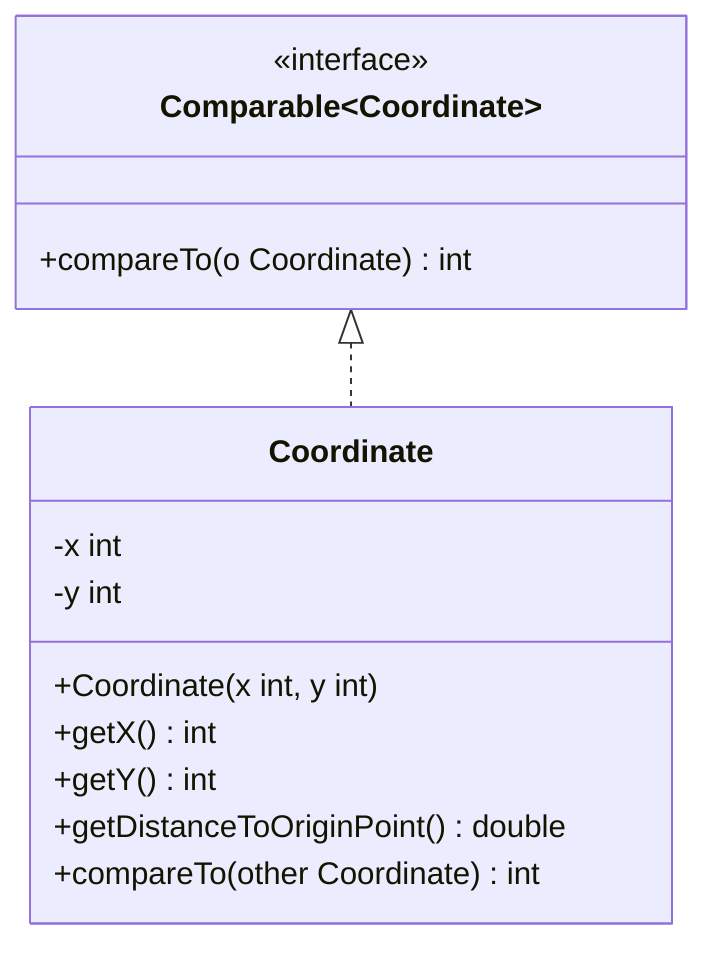

import Exercise from '@site/src/components/Exercise';

- Erstelle die Klasse `Coordinate` anhand des abgebildeten Klassendiagramms
- Erstelle eine ausführbare Klasse, welche eine Koordinatenliste mit mehreren
  Koordinaten erzeugt, diese sortiert und anschließend auf der Konsole ausgibt

## Klassendiagramm

## Hinweise zur Klasse Coordinate

- Die Methode `double getDistanceToOriginPoint()` soll die Distanz der
  Koordinate zum Nullpunkt zurückgeben
- Die Methode `int compareTo(other: Coordinate)` soll die Koordinate mit der
  eingehenden Koordinate anhand ihrer jeweiligen Distanz zum Nullpunkt
  vergleichen. Ist die Distanz der Koordinate zum Nullpunkt kleiner als bzw.
  größer als bzw. gleich die der eingehenden Koordinate, soll der Wert 1 bzw. -1
  bzw. 0 zurückgegeben werden

## Hinweis

Die statische Methode `double hypot(x: double, y: double)` der Klasse `Math`
berechnet die Hypotenuse zum eingehenden X- und Y-Wert.

<Exercise pullRequest="47" branchSuffix="comparators/01" />
