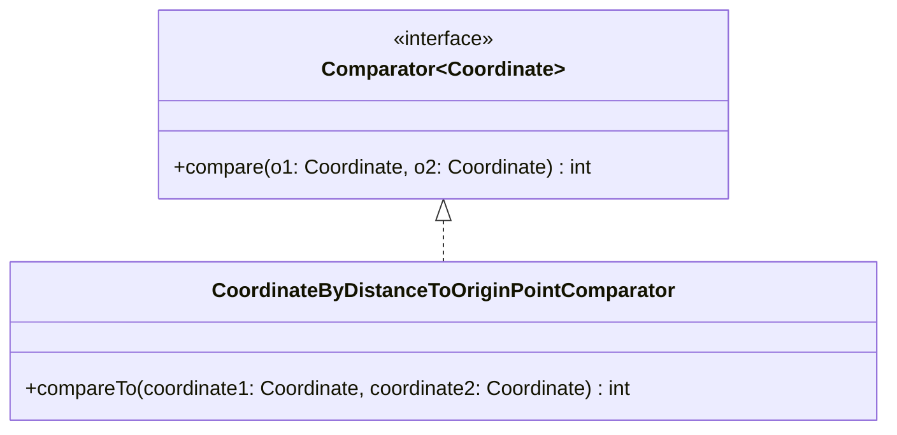

import Exercise from '@site/src/components/Exercise';

- Erstelle die Klasse `CoordinateByDistanceToOriginComparator` anhand des
  abgebildeten Klassendiagramms
- Passe die ausführbare Klasse aus Übungsaufgabe [Comparators01](comparators01)
  so an, dass die Koordinatenliste mit Hilfe der Klasse `CoordinateComparator`
  sortiert wird

## Klassendiagramm

## Hinweis zur Klasse _CoordinateByDistanceToOriginComparator_

Die Methode `int compare(coordinate1: Coordinate, coordinate2: Coordinate)` soll
zwei eingehende Koordinaten anhand ihrer jeweiligen Distanz zum Nullpunkt
vergleichen. Ist die Distanz der ersten Koordinate zum Nullpunkt kleiner als
bzw. größer als bzw. gleich die der zweiten Koordinate, soll der Wert -1 bzw. 1
bzw. 0 zurückgegeben werden.

<Exercise pullRequest="48" branchSuffix="comparators/02" />
