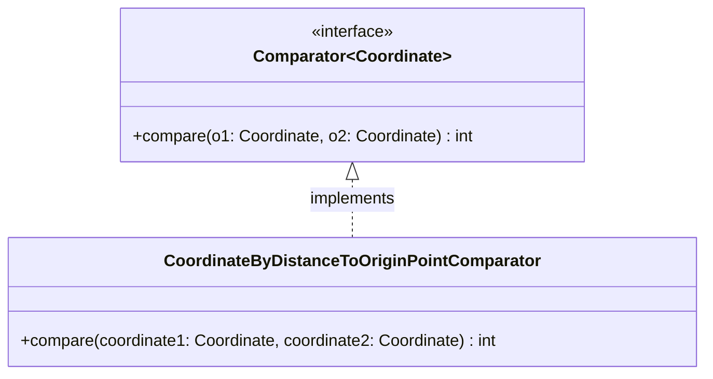

import Exercise from '@site/src/components/Exercise';

- Erstelle die Klasse `CoordinateByDistanceToOriginPointComparator` anhand des
  abgebildeten Klassendiagramms
- Passe die ausführbare Klasse aus Übungsaufgabe [Comparators01](comparators01)
  so an, dass die Koordinatenliste mit Hilfe der Klasse
  `CoordinateByDistanceToOriginPointComparator` sortiert wird

## Klassendiagramm

## Hinweis zur Klasse CoordinateByDistanceToOriginPointComparator

Die Methode `int compare(coordinate1: Coordinate, coordinate2: Coordinate)` soll
so implementiert werden, dass Koordinaten aufsteigend nach ihrem Abstand zum
Nullpunkt sortiert werden können

<Exercise branchSuffix="comparators-02" />
