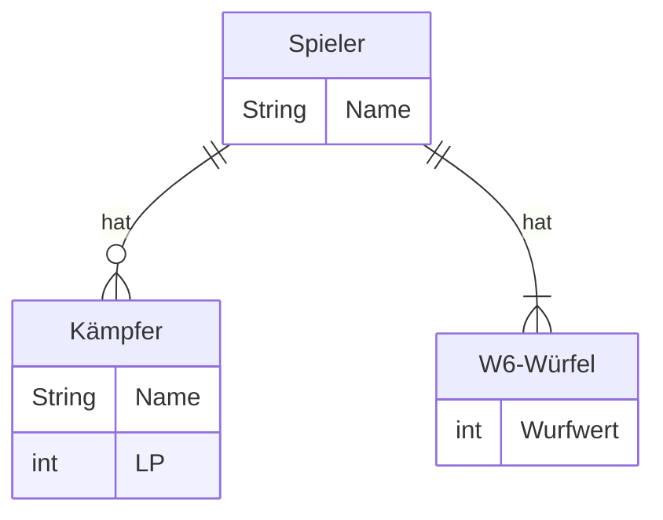

Passe die ausführbare Klasse aus Übungsaufgabe
[DataObjects03](../data-objects/data-objects03) wie folgt an:

- Es sollen zusätzliche Datenobjekte für alle zusätzlichen Eigenschaften des
  abgebildeten ER-Modells für 2 Spieler, 2 Kämpfer (je einer pro Spieler) und 10
  W6-Würfel (je 5 pro Spieler) deklariert werden
- Es soll möglich sein, den Datenobjekten für die Eigenschaften der Spieler und
  Kämpfer Werte über die Konsole zuzuweisen
- Es soll genau eine Runde umgesetzt werden

## ER-Modell



LP = Lebenspunkte

## Hinweis

Diese Aufgabe ist Teil einer Aufgabenreihe, in der Schritt für Schritt eine
abgespeckte Variante des Tabletop-Spiels
_[Warhammer 40,000 Kill Team](https://www.warhammer.com/en-GB/other-games-kill-team-LP)_
entwickelt werden soll. Bei diesem Strategiespiel für zwei Spieler kämpfen zwei
sogenannten Kill Teams mit dem Ziel gegeneinander, entsprechende Missionsziele
zu erfüllen bzw. das gegnerische Team auszulöschen.

## Ablauf einer Runde

Zu Beginn der Runde greift zunächst der Kämpfer des ersten Spielers den Kämpfer
des zweiten Spielers mit einem einfachen Angriff an. Anschließend greift der
Kämpfer des zweiten Spielers den Kämpfer des ersten Spielers mit einem einfachen
Angriff an.

## Ablauf eines einfachen Angriffs und Ermittlung des Schadens

Der angreifende Spieler würfelt mit 4 W6-Würfeln, der verteidigende Spieler
würfelt mit 3 W6-Würfeln. Anschließend wird der Schaden berechnet und dem
verteidigenden Spieler Lebenspunkte in Höhe des Schadens abgezogen. Der Schaden
berechnet sich dabei gemäß der Formel _Anzahl Treffer - Anzahl Blocks_. Die
Anzahl Treffer ergibt sich aus der Summe der Wurfwerte des angreifenden
Spielers, die Anzahl Blocks aus der Summe der Wurfwerte des verteidigenden
Spielers. Die Problematiken, dass ein verteidigender Spieler bei einem Angriff
"geheilt" wird (Anzahl Treffer < Anzahl Blocks) und dass ein "toter" Spieler
angreift (Schaden beim ersten Angriff >= LP), sollen aktuell noch ignoriert
werden.

## Beispielhafte Konsolenausgabe

```console
Spieler 1, Name: Hans
Spieler 1, Kämpfer 1, Name: Gregor
Spieler 1, Kämpfer 1, LP: 8

Spieler 2, Name: Peter
Spieler 2, Kämpfer 1, Name: Bonekraka
Spieler 2, Kämpfer 1, LP: 10

*-------*
* Zug 1 *
*-------*
Kämpfer von Hans: Gregor (8 LP)
Kämpfer von Peter: Bonekraka (10 LP)

Gregor greift Bonekraka an.
Gregor würfelt 6, 2, 3 und 2.
Gregor erzielt 13 Treffer.
Bonekraka würfelt 4, 1 und 5.
Bonekraka erzielt 10 Blocks.
Bonekraka erleidet 3 Schaden und hat noch 7 LP.

*-------*
* Zug 2 *
*-------*
Kämpfer von Hans: Gregor (8 LP)
Kämpfer von Peter: Bonekraka (7 LP)

Bonekraka greift Gregor an.
Bonekraka würfelt 1, 5, 3 und 1.
Bonekraka erzielt 10 Treffer.
Gregor würfelt 5, 4 und 2.
Gregor erzielt 11 Blocks.
Gregor erleidet -1 Schaden und hat noch 9 LP.
```
